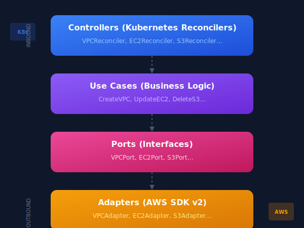

# Infra Operator

**Manage AWS Infrastructure with Kubernetes or CLI using YAML**

[](https://github.com/andrebassi/aws-infra-operator/releases)
[](LICENSE)
[](https://infra-operator.runner.codes)

**Website:** https://infra-operator-website.pages.dev

**Documentation:** https://infra-operator.runner.codes

📖 [Read the full documentation →](https://infra-operator.runner.codes)

## What is Infra Operator?

Infra Operator is a **production-ready tool** for managing AWS infrastructure resources. Define your infrastructure using declarative YAML and deploy it using:

- **Kubernetes Operator**: Manage AWS resources as CRDs with kubectl, Helm, ArgoCD, or any GitOps tool
- **Standalone CLI**: Manage AWS resources directly from command line, without Kubernetes

## Why Infra Operator?

| Feature | Description |
|---------|-------------|
| **Declarative YAML** | Define AWS resources as simple YAML manifests |
| **GitOps Ready** | Works with ArgoCD, Flux, and any GitOps workflow |
| **Two Modes** | Kubernetes Operator or standalone CLI |
| **30+ AWS Services** | VPC, EC2, RDS, S3, Lambda, EKS, and more |
| **Clean Architecture** | Testable, maintainable, and extensible codebase |
| **Production Ready** | Finalizers, status conditions, RBAC, metrics |

## Supported AWS Services (30+)

| Category | Services |
|----------|----------|
| **Networking** | VPC, Subnet, Internet Gateway, NAT Gateway, Route Table, Security Group, Elastic IP, ALB, NLB |
| **Compute** | EC2 Instance, Lambda, EKS Cluster, ECS Cluster, ComputeStack |
| **Storage** | S3 Bucket |
| **Database** | RDS Instance, DynamoDB Table, ElastiCache |
| **Container** | ECR Repository |
| **Messaging** | SQS Queue, SNS Topic |
| **Security** | IAM Role, Secrets Manager, KMS Key, ACM Certificate |
| **CDN & DNS** | CloudFront, Route53 Hosted Zone, Route53 Record Set |
| **API** | API Gateway |

## Quick Start

### Option 1: Kubernetes (Helm)

```bash
# Install with Helm
helm install infra-operator oci://ghcr.io/andrebassi/infra-operator \
  --namespace infra-operator \
  --create-namespace

# Verify installation
kubectl get pods -n infra-operator
kubectl get crds | grep aws-infra-operator
```

### Option 2: CLI (Standalone)

```bash
# Clone and build
git clone https://github.com/andrebassi/aws-infra-operator.git
cd aws-infra-operator
CGO_ENABLED=0 go build -o infra.operator main.go

# Apply resources
./infra.operator apply -f infrastructure.yaml
```

## Usage

### 1. Create AWS Provider

```yaml
# aws-provider.yaml
apiVersion: aws-infra-operator.runner.codes/v1alpha1
kind: AWSProvider
metadata:
  name: aws-production
spec:
  region: us-east-1
  credentialsSecret:
    name: aws-credentials
    namespace: infra-operator
```

### 2. Define Infrastructure

```yaml
# vpc.yaml
apiVersion: aws-infra-operator.runner.codes/v1alpha1
kind: VPC
metadata:
  name: production-vpc
spec:
  providerRef:
    name: aws-production
  cidrBlock: "10.0.0.0/16"
  enableDnsSupport: true
  enableDnsHostnames: true
  tags:
    Environment: production
    ManagedBy: infra-operator
```

### 3. Deploy

**Kubernetes:**
```bash
kubectl apply -f aws-provider.yaml
kubectl apply -f vpc.yaml
kubectl get vpc
```

**CLI:**
```bash
export AWS_ACCESS_KEY_ID="your-key"
export AWS_SECRET_ACCESS_KEY="your-secret"
export AWS_REGION="us-east-1"

./infra.operator apply -f vpc.yaml
./infra.operator get
```

## Helm Installation

### From GHCR (Recommended)

```bash
helm install infra-operator oci://ghcr.io/andrebassi/infra-operator \
  --namespace infra-operator \
  --create-namespace
```

### From Source

```bash
git clone https://github.com/andrebassi/aws-infra-operator.git
cd aws-infra-operator

helm install infra-operator ./chart \
  --namespace infra-operator \
  --create-namespace
```

### Configuration Values

| Parameter | Default | Description |
|-----------|---------|-------------|
| `image.registry` | `ghcr.io` | Container registry |
| `image.repository` | `andrebassi/aws-infra-operator` | Image repository |
| `image.tag` | `latest` | Image tag |
| `replicaCount` | `1` | Number of replicas |
| `resources.requests.memory` | `128Mi` | Memory request |
| `resources.limits.memory` | `512Mi` | Memory limit |

### Custom Values

```bash
helm install infra-operator oci://ghcr.io/andrebassi/infra-operator \
  --namespace infra-operator \
  --create-namespace \
  --set replicaCount=2 \
  --set resources.requests.memory=256Mi
```

## Authentication

### IRSA (Recommended for EKS)

```yaml
apiVersion: aws-infra-operator.runner.codes/v1alpha1
kind: AWSProvider
metadata:
  name: aws-production
spec:
  region: us-east-1
  roleARN: arn:aws:iam::123456789012:role/infra-operator-role
```

### Static Credentials

```bash
# Create secret
kubectl create secret generic aws-credentials \
  --namespace infra-operator \
  --from-literal=AWS_ACCESS_KEY_ID=your-key \
  --from-literal=AWS_SECRET_ACCESS_KEY=your-secret
```

```yaml
apiVersion: aws-infra-operator.runner.codes/v1alpha1
kind: AWSProvider
metadata:
  name: aws-production
spec:
  region: us-east-1
  credentialsSecret:
    name: aws-credentials
    namespace: infra-operator
```

### LocalStack (Development)

```yaml
apiVersion: aws-infra-operator.runner.codes/v1alpha1
kind: AWSProvider
metadata:
  name: localstack
spec:
  region: us-east-1
  endpoint: http://localstack.default.svc.cluster.local:4566
  credentialsSecret:
    name: aws-credentials
    namespace: infra-operator
```

## Architecture

Infra Operator follows **Clean Architecture** principles:

<p align="center">
  
</p>

## Project Structure

```
aws-infra-operator/
├── api/v1alpha1/           # CRD type definitions (30 resources)
├── controllers/            # Kubernetes reconcilers
├── internal/
│   ├── adapters/aws/       # AWS SDK implementations
│   ├── domain/             # Business logic
│   ├── ports/              # Interface definitions
│   └── usecases/           # Use case orchestration
├── pkg/
│   ├── drift/              # Drift detection
│   └── metrics/            # Prometheus metrics
├── chart/                  # Helm chart
│   ├── crds/               # CRD manifests
│   ├── templates/          # Kubernetes resources
│   └── values.yaml         # Default configuration
├── samples/                # Example resources
├── Dockerfile
├── go.mod
└── main.go
```

## Development

### Prerequisites

- Go 1.23+
- Docker
- kubectl
- Helm 3.x

### Build

```bash
# Build binary
CGO_ENABLED=0 go build -o infra.operator main.go

# Build Docker image
docker build -t infra-operator:dev .

# Run locally
./infra.operator
```

### Testing with LocalStack

```bash
# Start LocalStack
docker run -d --name localstack \
  -p 4566:4566 \
  localstack/localstack

# Apply samples
kubectl apply -f samples/
```

## Documentation

Full documentation available at [infra-operator.runner.codes](https://infra-operator.runner.codes)

- [Installation](https://infra-operator.runner.codes/installation)
- [Quick Start](https://infra-operator.runner.codes/quickstart)
- [CLI Mode](https://infra-operator.runner.codes/features/cli)
- [AWS Services](https://infra-operator.runner.codes/services/networking/vpc)
- [API Reference](https://infra-operator.runner.codes/api-reference/overview)

## Troubleshooting

### Pods not starting

```bash
kubectl logs -n infra-operator deploy/infra-operator --tail=100
kubectl get events -n infra-operator --sort-by='.lastTimestamp'
```

### AWSProvider not Ready

```bash
kubectl describe awsprovider aws-production
aws sts get-caller-identity --region us-east-1
```

### Resources stuck in NotReady

```bash
kubectl describe vpc production-vpc
kubectl get events --field-selector involvedObject.name=production-vpc
```

## License

[MIT](LICENSE)

## Author

Developed by [André Bassi](https://andrebassi.com.br)
