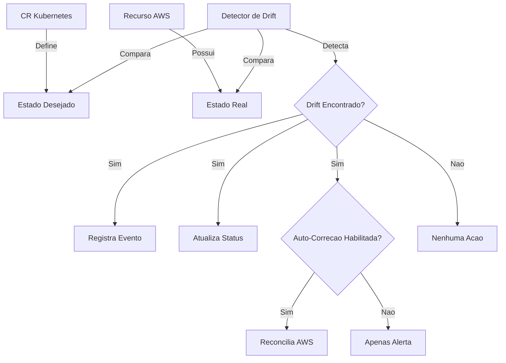

# Deteccao de Drift e Auto-Correcao

## Visao Geral

**Deteccao de Drift** e uma funcionalidade que detecta automaticamente quando o estado real dos recursos AWS difere do estado desejado definido nos seus Custom Resources (CRs) do Kubernetes, mesmo quando os CRs nao foram alterados.

### O que e Drift?

Drift (desvio) ocorre quando a infraestrutura e modificada fora do operator, como:

- Mudancas manuais pelo Console AWS
- Modificacoes via AWS CLI ou outras ferramentas
- Alteracoes feitas por outros sistemas de automacao
- Modificacoes acidentais por membros da equipe
- Atualizacoes ou migracoes de servicos AWS

### Por que a Deteccao de Drift Importa

Sem deteccao de drift:
- Mudancas manuais podem quebrar sua infraestrutura
- Violacoes de conformidade passam despercebidas
- Inconsistencias de configuracao se acumulam
- Debugging se torna mais dificil ao longo do tempo
- Workflows GitOps perdem sua unica fonte de verdade

Com deteccao de drift:
- Deteccao automatica de todas as mudancas
- Auto-correcao configuravel ou alertas
- Relatorios detalhados de drift no status do recurso
- Eventos Kubernetes para monitoramento
- Mantem a consistencia da infraestrutura

## Como Funciona



### Processo de Deteccao

1. **Verificacoes Periodicas**: Controller verifica drift em intervalos configurados (padrao: 5 minutos)
2. **Comparacao**: Compara estado desejado (CR) com estado real (API AWS)
3. **Classificacao**: Categoriza drifts por severidade (baixa, media, alta)
4. **Filtragem**: Aplica padroes de ignorar e limites de severidade
5. **Acao**: Auto-corrige ou alerta baseado na configuracao

## Configuracao

### Habilitar Deteccao de Drift no AWSProvider

Configure a deteccao de drift no nivel do provider:

```yaml
apiVersion: aws-infra-operator.runner.codes/v1alpha1
kind: AWSProvider
metadata:
  name: production-aws
spec:
  region: us-east-1
  roleARN: arn:aws:iam::123456789012:role/infra-operator-role

  # Configuracao de Deteccao de Drift
  driftDetection:
    # Habilitar deteccao de drift (padrao: true)
    enabled: true

    # Intervalo de verificacao de drift (padrao: "5m")
    # Aceita: "1m", "5m", "15m", "1h", etc.
    checkInterval: "5m"

    # Auto-corrigir drifts detectados (padrao: true)
    # true: corrige automaticamente atualizando AWS
    # false: apenas alerta via eventos e status (modo somente-alerta)
    autoHeal: true

    # Campos a ignorar na deteccao de drift
    # Suporta wildcards (*)
    ignoreFields:
      - "tags.aws:*"           # Ignora tags gerenciadas pela AWS
      - "lastModified"         # Ignora timestamps de modificacao
      - "status.*"             # Ignora campos de status
      - "tags.LastUpdated"     # Ignora tags especificas

    # Nivel minimo de severidade para reportar (padrao: "medium")
    # Opcoes: "low", "medium", "high"
    # Apenas drifts neste nivel ou acima disparam reconciliacao
    severityThreshold: "medium"
```

### Opcoes de Configuracao

| Campo | Tipo | Padrao | Descricao |
|-------|------|--------|-----------|
| `enabled` | boolean | `true` | Habilita/desabilita deteccao de drift |
| `checkInterval` | string | `"5m"` | Frequencia de verificacao de drift |
| `autoHeal` | boolean | `true` | Corrigir automaticamente vs apenas alertar |
| `ignoreFields` | []string | `["tags.aws:*", "lastModified", "status.*"]` | Padroes de campos a ignorar |
| `severityThreshold` | string | `"medium"` | Severidade minima para agir |

## Niveis de Severidade de Drift

O operator atribui automaticamente niveis de severidade baseado no campo que sofreu drift:

### Alta Severidade
Campos que afetam seguranca, rede ou funcionalidade critica:
- Security groups
- IAM roles
- Configuracoes de criptografia
- Flags de acesso publico
- Blocos CIDR
- Configuracoes de rede

**Exemplo:**
```yaml
# Drift de alta severidade detectado
status:
  driftDetected: true
  driftDetails:
    - field: "securityGroupIds[0]"
      expected: "sg-prod-123"
      actual: "sg-dev-456"
      severity: "high"
```

### Media Severidade
Campos que afetam funcionalidade mas nao seguranca:
- Tipos de instancia
- Tamanhos de armazenamento
- Configuracoes de conexao
- Configuracoes de recursos

**Exemplo:**
```yaml
# Drift de media severidade detectado
status:
  driftDetected: true
  driftDetails:
    - field: "instanceType"
      expected: "t3.large"
      actual: "t3.medium"
      severity: "medium"
```

### Baixa Severidade
Metadados e campos cosmeticos:
- Tags (exceto tags de seguranca)
- Descricoes
- Nomes
- Metadados nao-criticos

**Exemplo:**
```yaml
# Drift de baixa severidade detectado
status:
  driftDetected: true
  driftDetails:
    - field: "tags.Description"
      expected: "VPC de Producao"
      actual: "VPC Prod"
      severity: "low"
```

## Verificando Status de Drift

### Ver Drift no Status do Recurso

```bash
kubectl get vpc production-vpc -o yaml
```

```yaml
apiVersion: aws-infra-operator.runner.codes/v1alpha1
kind: VPC
metadata:
  name: production-vpc
spec:
  cidrBlock: "10.0.0.0/16"
  tags:
    Environment: production
status:
  ready: true
  vpcID: vpc-0123456789abcdef

  # Status de Deteccao de Drift
  driftDetected: true
  lastDriftCheck: "2024-11-23T10:30:00Z"
  driftDetails:
    - field: "tags.Environment"
      expected: "production"
      actual: "prod"
      severity: "low"
    - field: "enableDnsHostnames"
      expected: "true"
      actual: "false"
      severity: "medium"
```

### Ver Eventos de Drift

```bash
kubectl get events --field-selector involvedObject.name=production-vpc
```

```
LAST SEEN   TYPE      REASON              MESSAGE
2m          Warning   DriftDetected       Detectados 2 drift(s) para VPC vpc-123 (alta: 0, media: 1, baixa: 1)
2m          Warning   HighSeverityDrift   Drift de alta severidade em securityGroupIds: desejado=sg-prod, real=sg-dev
1m          Normal    DriftHealed         Auto-corrigidos 2 drift(s) para VPC vpc-123
```

### Monitorar Drift com kubectl

```bash
# Verificar todos os recursos com drift
kubectl get vpc,elasticip,s3bucket -A -o json | \
  jq '.items[] | select(.status.driftDetected == true) | {name: .metadata.name, drifts: .status.driftDetails}'

# Contar drifts por severidade
kubectl get vpc -o json | \
  jq '[.items[].status.driftDetails[]?.severity] | group_by(.) | map({severity: .[0], count: length})'
```

## Auto-Correcao

Quando `autoHeal: true`, o operator corrige automaticamente os drifts:

### Como a Auto-Correcao Funciona

1. **Detecta Drift**: Operator detecta diferenca entre CR e AWS
2. **Avalia**: Verifica se drift corresponde a padroes de ignorar ou limite de severidade
3. **Corrige**: Atualiza recurso AWS para corresponder a especificacao do CR
4. **Verifica**: Re-verifica para confirmar que drift foi resolvido
5. **Registra**: Cria evento Kubernetes e atualiza status

### Exemplo: Auto-Correcao de Tags

```yaml
# CR define estas tags
apiVersion: aws-infra-operator.runner.codes/v1alpha1
kind: VPC
metadata:
  name: prod-vpc
spec:
  cidrBlock: "10.0.0.0/16"
  tags:
    Environment: production
    Team: platform
```

**Cenario:** Alguem muda manualmente as tags no Console AWS:
- `Environment: prod` (alterado)
- `Team: platform` (sem mudanca)
- `Owner: john` (adicionado)

**Processo de Auto-Correcao:**
1. Operator detecta drift nas tags
2. Registra drift no status e eventos
3. **Automaticamente** atualiza tags AWS para corresponder ao CR:
   - Restaura `Environment: production`
   - Remove `Owner: john` (nao esta no CR)
4. Atualiza status: `driftDetected: false`

### Implementacao da Funcao de Correcao

Cada tipo de recurso tem sua propria funcao de correcao:

```go
// Exemplo: funcao de correcao de VPC
func (r *VPCReconciler) healVPCDrift(ctx context.Context, drifts []DriftItem, vpcCR *VPC) error {
    // Converte CR para modelo de dominio
    v := mapper.CRToDomainVPC(vpcCR)

    // Sincroniza estado AWS para corresponder ao CR
    if err := r.vpcUseCase.SyncVPC(ctx, v); err != nil {
        return fmt.Errorf("falha ao corrigir drift: %w", err)
    }

    return nil
}
```

## Modo Somente-Alerta

Quando `autoHeal: false`, o operator apenas reporta drifts sem corrigi-los:

```yaml
driftDetection:
  enabled: true
  autoHeal: false  # Modo somente-alerta
  checkInterval: "5m"
```

**Comportamento:**
- Detecta todos os drifts
- Registra eventos
- Atualiza status com detalhes do drift
- NAO modifica recursos AWS
- NAO auto-corrige

**Casos de Uso:**
- Ambientes de producao que requerem aprovacao manual
- Auditoria de conformidade sem auto-remediacao
- Testar deteccao de drift antes de habilitar auto-correcao
- Recursos gerenciados por multiplos sistemas

## Padroes de Ignorar

### Padroes de Caminho de Campo

Use padroes de ignorar para excluir campos da deteccao de drift:

```yaml
driftDetection:
  ignoreFields:
    # Correspondencia exata
    - "lastModified"

    # Prefixo com wildcard
    - "tags.aws:*"      # Ignora todas as tags comecando com "aws:"
    - "status.*"        # Ignora todos os campos de status

    # Tag especifica
    - "tags.LastSync"   # Ignora esta tag especifica
```

### Padroes Comuns de Ignorar

```yaml
# Campos gerenciados pela AWS
ignoreFields:
  - "tags.aws:*"
  - "lastModified"
  - "createdTime"
  - "status.*"

  # Tags de sistemas externos
  - "tags.terraform:*"
  - "tags.cloudformation:*"

  # Tags de monitoramento (gerenciadas externamente)
  - "tags.LastBackup"
  - "tags.LastPatched"
  - "tags.MonitoringEnabled"
```

## Boas Praticas

### 1. Comece com Modo Somente-Alerta

```yaml
# Deploy inicial
driftDetection:
  enabled: true
  autoHeal: false  # Comece apenas com alertas
  checkInterval: "5m"
```

**Fluxo de Trabalho:**
1. Faca deploy com `autoHeal: false`
2. Monitore eventos de drift por 1-2 semanas
3. Identifique padroes e adicione ao `ignoreFields`
4. Habilite `autoHeal: true` quando estiver confiante

### 2. Use Intervalos de Verificacao Apropriados

```yaml
# Producao: equilibrio entre velocidade de deteccao e custos de API
driftDetection:
  checkInterval: "5m"    # Bom equilibrio

# Desenvolvimento: deteccao mais rapida
driftDetection:
  checkInterval: "1m"    # Mais chamadas de API AWS

# Sensivel a custos: verificacoes mais lentas
driftDetection:
  checkInterval: "15m"   # Menos chamadas de API AWS
```

### 3. Configure Limites de Severidade

```yaml
# Apenas auto-corrigir drifts criticos
driftDetection:
  autoHeal: true
  severityThreshold: "high"  # Apenas drifts de alta severidade
```

**Limites Recomendados:**
- **Producao**: `"high"` - Apenas problemas criticos de seguranca/rede
- **Staging**: `"medium"` - Maioria dos problemas de funcionalidade
- **Desenvolvimento**: `"low"` - Todos os drifts incluindo cosmeticos

### 4. Ignore Tags de Sistemas Externos

```yaml
# Quando usando multiplas ferramentas de infraestrutura
driftDetection:
  ignoreFields:
    - "tags.terraform:*"
    - "tags.cloudformation:*"
    - "tags.backup:*"
    - "tags.monitoring:*"
```

### 5. Monitore Metricas de Drift

Configure monitoramento para eventos de drift:

```yaml
# Exemplo de alerta Prometheus
- alert: DriftAltaSeveridadeDetectado
  expr: |
    sum(kube_event_count{reason="HighSeverityDrift"}) > 0
  for: 5m
  annotations:
    summary: "Drift de alta severidade detectado em recursos AWS"
```

## Troubleshooting

### Drift Nao Detectado

**Problema:** Drift existe mas nao esta sendo detectado

**Solucoes:**
1. Verifique se a deteccao de drift esta habilitada:
   ```bash
   kubectl get awsprovider -o jsonpath='{.items[*].spec.driftDetection.enabled}'
   ```

2. Verifique se o intervalo de verificacao passou:
   ```bash
   kubectl get vpc -o jsonpath='{.items[*].status.lastDriftCheck}'
   ```

3. Verifique se o campo esta na lista de ignorar:
   ```bash
   kubectl get awsprovider -o jsonpath='{.items[*].spec.driftDetection.ignoreFields}'
   ```

### Auto-Correcao Nao Funciona

**Problema:** Drift detectado mas nao corrigindo

**Solucoes:**
1. Verifique se auto-correcao esta habilitada:
   ```bash
   kubectl get awsprovider -o jsonpath='{.items[*].spec.driftDetection.autoHeal}'
   ```

2. Verifique o limite de severidade:
   ```bash
   # Se o limite e "high", drifts de media/baixa severidade nao serao auto-corrigidos
   kubectl get awsprovider -o jsonpath='{.items[*].spec.driftDetection.severityThreshold}'
   ```

3. Verifique os logs do operator:
   ```bash
   kubectl logs -n infra-operator-system deployment/infra-operator-controller-manager | grep drift
   ```

### Falsos Positivos de Drift

**Problema:** Mudancas externas legitimas marcadas como drift

**Solucoes:**
1. Adicione campos a lista de ignorar:
   ```yaml
   driftDetection:
     ignoreFields:
       - "tags.ManagedByExternal"
       - "specificField"
   ```

2. Reduza o limite de severidade:
   ```yaml
   driftDetection:
     severityThreshold: "high"  # Ignora severidade baixa/media
   ```

## Exemplos

### Exemplo 1: Setup de Producao com Alta Seguranca

```yaml
apiVersion: aws-infra-operator.runner.codes/v1alpha1
kind: AWSProvider
metadata:
  name: production-aws
spec:
  region: us-east-1
  roleARN: arn:aws:iam::123456789012:role/infra-operator

  driftDetection:
    enabled: true
    checkInterval: "5m"
    autoHeal: true
    severityThreshold: "high"  # Apenas auto-corrige problemas criticos
    ignoreFields:
      - "tags.aws:*"
      - "tags.backup:*"
      - "lastModified"
```

### Exemplo 2: Desenvolvimento com Auto-Correcao Total

```yaml
apiVersion: aws-infra-operator.runner.codes/v1alpha1
kind: AWSProvider
metadata:
  name: dev-aws
spec:
  region: us-east-1
  roleARN: arn:aws:iam::123456789012:role/infra-operator

  driftDetection:
    enabled: true
    checkInterval: "1m"        # Verificacoes mais rapidas em dev
    autoHeal: true
    severityThreshold: "low"   # Auto-corrige tudo
    ignoreFields:
      - "tags.aws:*"
```

### Exemplo 3: Modo Auditoria (Sem Auto-Correcao)

```yaml
apiVersion: aws-infra-operator.runner.codes/v1alpha1
kind: AWSProvider
metadata:
  name: audit-aws
spec:
  region: us-east-1
  roleARN: arn:aws:iam::123456789012:role/infra-operator

  driftDetection:
    enabled: true
    checkInterval: "15m"
    autoHeal: false           # Apenas alerta, sem mudancas
    severityThreshold: "low"  # Reporta todos os drifts
    ignoreFields: []          # Sem ignorar, detecta tudo
```

## Funcionalidades Relacionadas

- [Gerenciamento de Status](/docs/concepts/status-management) - Como o status e atualizado
- [Politicas de Delecao](/docs/concepts/deletion-policies) - Limpeza de recursos
- [AWS Provider](/docs/concepts/aws-provider) - Gerenciamento de credenciais

## Referencia da API

Veja a especificacao completa da API na documentacao de CRDs:
- [AWSProvider DriftDetectionConfig](/docs/api-reference/awsprovider#driftdetectionconfig)
- [VPC DriftDetail](/docs/api-reference/vpc#driftdetail)
- [Campos de Status](/docs/api-reference/common-status#drift-fields)
