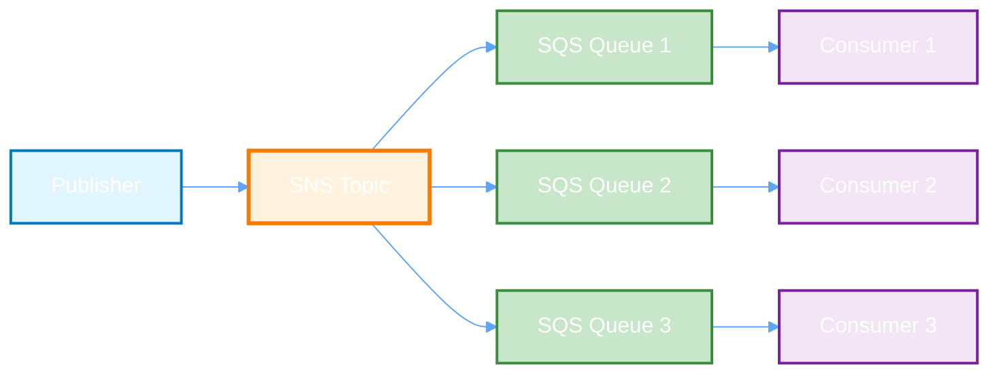
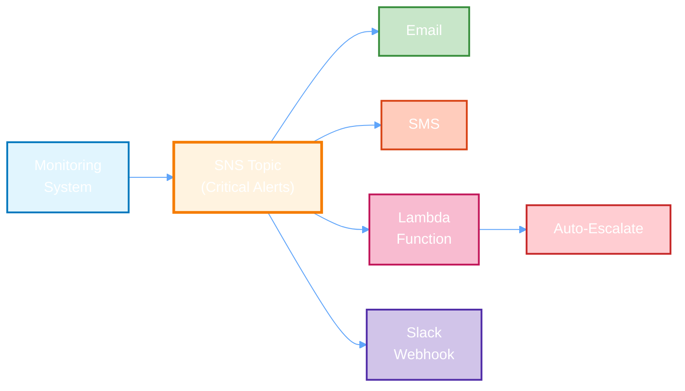
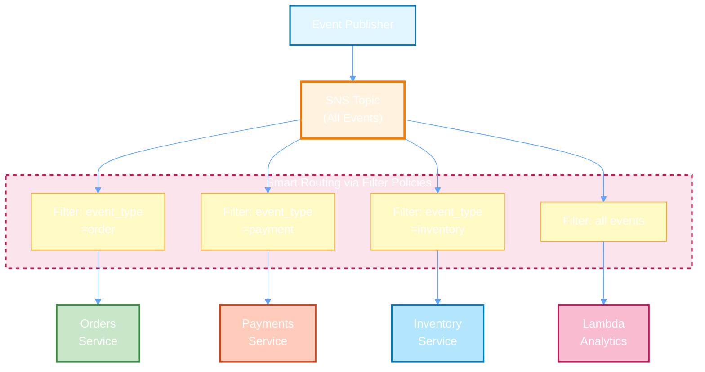
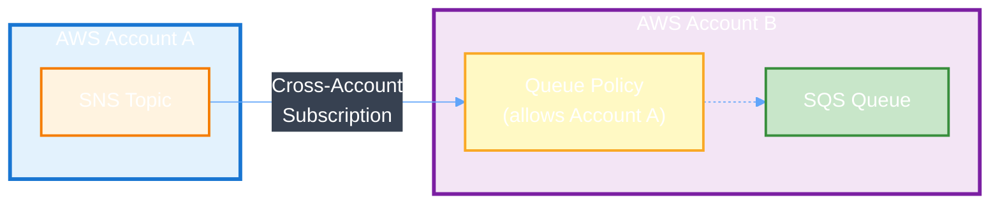

Serviço de publicação/assinatura de mensagens totalmente gerenciado, escalável e altamente disponível para notificações, alertas e comunicação distribuída.

## Pré-requisito: Configuração do AWSProvider

Antes de criar qualquer recurso AWS, você precisa configurar um **AWSProvider** que gerencia as credenciais e autenticação com a AWS.

<CodeGroup>
```yaml IRSA
apiVersion: infra.operator.aws.io/v1alpha1
kind: AWSProvider
metadata:
  name: production-aws
  namespace: default
spec:
  region: us-east-1
  roleARN: arn:aws:iam::123456789012:role/infra-operator-role
  defaultTags:
    managed-by: infra-operator
    environment: production
```

```yaml Credenciais Estáticas
apiVersion: v1
kind: Secret
metadata:
  name: aws-credentials
  namespace: default
type: Opaque
stringData:
  access-key-id: test
  secret-access-key: test
---
apiVersion: infra.operator.aws.io/v1alpha1
kind: AWSProvider
metadata:
  name: localstack
  namespace: default
spec:
  region: us-east-1
  accessKeyIDRef:
    name: aws-credentials
    key: access-key-id
  secretAccessKeyRef:
    name: aws-credentials
    key: secret-access-key
  defaultTags:
    managed-by: infra-operator
    environment: test
```

```bash Verificar Status
kubectl get awsprovider
kubectl describe awsprovider production-aws
```
</CodeGroup>

<Warning>
  Para produção, sempre use **IRSA** (IAM Roles for Service Accounts) ao invés de credenciais estáticas.
</Warning>

### Criar IAM Role para IRSA

Para usar IRSA em produção, você precisa criar uma IAM Role com as permissões necessárias:

<CodeGroup>
```json Trust Policy (trust-policy.json)
{
  "Version": "2012-10-17",
  "Statement": [
    {
      "Effect": "Allow",
      "Principal": {
        "Federated": "arn:aws:iam::123456789012:oidc-provider/oidc.eks.us-east-1.amazonaws.com/id/EXAMPLED539D4633E53DE1B71EXAMPLE"
      },
      "Action": "sts:AssumeRoleWithWebIdentity",
      "Condition": {
        "StringEquals": {
          "oidc.eks.us-east-1.amazonaws.com/id/EXAMPLED539D4633E53DE1B71EXAMPLE:sub": "system:serviceaccount:infra-operator-system:infra-operator-controller-manager",
          "oidc.eks.us-east-1.amazonaws.com/id/EXAMPLED539D4633E53DE1B71EXAMPLE:aud": "sts.amazonaws.com"
        }
      }
    }
  ]
}
```

```json IAM Policy - SNS (sns-policy.json)
{
  "Version": "2012-10-17",
  "Statement": [
    {
      "Effect": "Allow",
      "Action": [
        "sns:CreateTopic",
        "sns:DeleteTopic",
        "sns:GetTopicAttributes",
        "sns:SetTopicAttributes",
        "sns:Subscribe",
        "sns:Unsubscribe",
        "sns:TagResource",
        "sns:UntagResource",
        "sns:ListTagsForResource"
      ],
      "Resource": "*"
    }
  ]
}
```

```bash Criar Role com AWS CLI
# 1. Obter OIDC Provider do cluster EKS
export CLUSTER_NAME=my-cluster
export AWS_REGION=us-east-1
export AWS_ACCOUNT_ID=$(aws sts get-caller-identity --query Account --output text)

OIDC_PROVIDER=$(aws eks describe-cluster \
  --name $CLUSTER_NAME \
  --region $AWS_REGION \
  --query "cluster.identity.oidc.issuer" \
  --output text | sed -e "s/^https:\/\///")

# 2. Atualizar trust-policy.json com valores corretos
cat > trust-policy.json <<EOF
{
  "Version": "2012-10-17",
  "Statement": [
    {
      "Effect": "Allow",
      "Principal": {
        "Federated": "arn:aws:iam::${AWS_ACCOUNT_ID}:oidc-provider/${OIDC_PROVIDER}"
      },
      "Action": "sts:AssumeRoleWithWebIdentity",
      "Condition": {
        "StringEquals": {
          "${OIDC_PROVIDER}:sub": "system:serviceaccount:infra-operator-system:infra-operator-controller-manager",
          "${OIDC_PROVIDER}:aud": "sts.amazonaws.com"
        }
      }
    }
  ]
}
EOF

# 3. Criar IAM Role
aws iam create-role \
  --role-name infra-operator-sns-role \
  --assume-role-policy-document file://trust-policy.json \
  --description "Role for Infra Operator SNS management"

# 4. Criar e anexar policy
aws iam put-role-policy \
  --role-name infra-operator-sns-role \
  --policy-name SNSManagement \
  --policy-document file://sns-policy.json

# 5. Obter ARN da Role
aws iam get-role \
  --role-name infra-operator-sns-role \
  --query 'Role.Arn' \
  --output text
```

```bash Anotar ServiceAccount do Operator
# Adicionar annotation ao ServiceAccount do operator
kubectl annotate serviceaccount infra-operator-controller-manager \
  -n infra-operator-system \
  eks.amazonaws.com/role-arn=arn:aws:iam::123456789012:role/infra-operator-sns-role
```
</CodeGroup>

<Note>
  Substitua `123456789012` pelo seu AWS Account ID e `EXAMPLED539D4633E53DE1B71EXAMPLE` pelo ID do seu OIDC provider.
</Note>

## Visão Geral

O Amazon SNS (Simple Notification Service) é um serviço de pub/sub totalmente gerenciado que permite publicar mensagens para múltiplos subscribers (assinantes) simultaneamente. Com SNS, você pode:

- Publicar mensagens para múltiplos subscribers (fan-out pattern)
- Enviar notificações por email, SMS, push notifications
- Integrar com SQS, Lambda, HTTP endpoints e aplicações
- Garantir entrega com retry automático
- Usar tópicos FIFO para ordem garantida de mensagens
- Aplicar filter policies para routing inteligente
- Implementar padrões como fan-out e broadcast

## Início Rápido

A configuração SNS mais simples com fan-out:

<CodeGroup>
```yaml Tópico SNS Standard
apiVersion: infra.operator.aws.io/v1alpha1
kind: SNSTopic
metadata:
  name: e2e-test-topic
  namespace: default
spec:
  topicName: e2e-notifications
  providerRef:
    name: localstack
  displayName: E2E Test Notifications
  subscriptions:
  - protocol: sqs
    endpoint: arn:aws:sqs:us-east-1:000000000000:e2e-test-messages-queue
  tags:
    Environment: test
    ManagedBy: infra-operator
  deletionPolicy: Delete
```

```yaml Tópico SNS FIFO
apiVersion: infra.operator.aws.io/v1alpha1
kind: SNSTopic
metadata:
  name: e2e-fifo-topic
  namespace: default
spec:
  topicName: e2e-notifications.fifo
  providerRef:
    name: localstack
  fifoTopic: true
  contentBasedDeduplication: true
  subscriptions:
  - protocol: sqs
    endpoint: arn:aws:sqs:us-east-1:000000000000:e2e-test-fifo.fifo
  tags:
    Type: FIFO
    Environment: test
  deletionPolicy: Delete
```

```yaml Tópico de Produção
apiVersion: infra.operator.aws.io/v1alpha1
kind: SNSTopic
metadata:
  name: order-notifications
  namespace: default
spec:
  providerRef:
    name: production-aws
  topicName: order-notifications
  displayName: Order Notifications
  subscriptions:
  - protocol: email
    endpoint: team@example.com
  - protocol: sqs
    endpoint: arn:aws:sqs:us-east-1:123456789012:order-queue
  tags:
    Environment: production
    Team: backend
  deletionPolicy: Retain
```

```bash Aplicar
kubectl apply -f sns-topic.yaml
```

```bash Verificar Status
kubectl get snstopics
kubectl describe snstopic order-notifications
kubectl get snstopic order-notifications -o yaml
```

```bash Acompanhar Criação
kubectl get snstopic order-notifications -w
```

```bash Publicar Mensagem de Teste
aws sns publish \
  --topic-arn arn:aws:sns:us-east-1:123456789012:order-notifications \
  --message "Test message" \
  --subject "Test Subject" \
  --region us-east-1
```
</CodeGroup>

## Referência de Configuração

### Campos Obrigatórios

<ParamField path="spec.providerRef" type="object" required>
  Referência ao recurso AWSProvider que gerencia a autenticação AWS

  <Expandable title="properties">
    <ParamField path="name" type="string" required>
      Nome do recurso AWSProvider a ser utilizado
    </ParamField>
  </Expandable>
</ParamField>

<ParamField path="spec.topicName" type="string" required>
  Nome do tópico SNS

  **Requisitos:**
  - Standard topic: Nome entre 1-256 caracteres
  - FIFO topic: Nome deve terminar com `.fifo`, entre 1-256 caracteres
  - Apenas caracteres alfanuméricos, hífens e sublinhados
  - Exemplo: `order-notifications` ou `payments.fifo`

  <Note>O nome deve ser único dentro da região AWS</Note>
</ParamField>

### Campos Opcionais

<ParamField path="spec.displayName" type="string">
  Nome legível do tópico exibido em notificações de email/SMS

  **Exemplo**: `Order Notifications`
</ParamField>

<ParamField path="spec.fifoTopic" type="boolean" default="false">
  Se `true`, cria um tópico FIFO (First-In-First-Out) com garantia de ordem de processamento

  **Implicações:**
  - FIFO: Ordem garantida, throughput ~300 msg/s
  - Standard: Melhor throughput (ilimitado), sem garantia de ordem

  **Use FIFO quando:** Ordem importa (transações, pagamentos, eventos críticos)
</ParamField>

<ParamField path="spec.contentBasedDeduplication" type="boolean" default="false">
  Para tópicos FIFO, habilita deduplicação baseada no hash do conteúdo da mensagem

  <Note>Somente aplicável quando `fifoTopic: true`</Note>
</ParamField>

<ParamField path="spec.subscriptions" type="array">
  Lista de subscriptions (assinantes) que receberão as mensagens publicadas

  <Expandable title="properties">
    <ParamField path="protocol" type="string" required>
      Protocolo de entrega da mensagem

      **Valores suportados:**
      - `email`: Envia para endereço de email
      - `email-json`: Email com JSON estruturado
      - `sms`: Envia SMS para número de telefone
      - `sqs`: Envia para fila SQS
      - `lambda`: Invoca função Lambda
      - `http`: POST para endpoint HTTP
      - `https`: POST para endpoint HTTPS
      - `application`: Mobile push notification

      **Custo:** Email grátis, SMS tem custo, outros varia
    </ParamField>

    <ParamField path="endpoint" type="string" required>
      Destino da mensagem

      **Exemplos por protocolo:**
      - email: `team@example.com`
      - sms: `+5511999999999`
      - sqs: `arn:aws:sqs:us-east-1:123456789012:order-queue`
      - lambda: `arn:aws:lambda:us-east-1:123456789012:function:process-event`
      - http: `https://api.example.com/webhook`
      - application: `arn:aws:sns:us-east-1:123456789012:app/GCM/MyApp/abcdef`
    </ParamField>

    <ParamField path="rawMessageDelivery" type="boolean" default="false">
      Se `true`, SNS envia apenas o corpo da mensagem (sem envoltório SNS)

      **Use quando:** Integrando com SQS ou Lambda (menos overhead)
    </ParamField>

    <ParamField path="filterPolicy" type="object">
      Policy para filtrar quais mensagens são entregues a este subscription

      **Exemplo:**
      ```json
      {
        "store": ["example_corp"],
        "order_type": ["order-placed", "order-canceled"],
        "price": [{"numeric": [">", 100]}]
      }
      ```

      **Benefício:** Reduz custos (não envia mensagens desnecessárias)
    </ParamField>

    <ParamField path="redrivePolicy" type="object">
      Dead Letter Queue para mensagens que falharam na entrega

      **Propriedades:**
      - `deadLetterTargetArn`: ARN da fila SQS para falhas
      - `maxReceiveCount`: Quantas tentativas antes de enviar para DLQ
    </ParamField>
  </Expandable>

  **Importância:** Subscriptions definem para quem e como as mensagens são entregues
</ParamField>

<ParamField path="spec.kmsKeyId" type="string">
  ID ou ARN da chave AWS KMS para criptografia de mensagens em repouso

  Exemplo: `arn:aws:kms:us-east-1:123456789012:key/12345678-1234-1234-1234-123456789012`

  **Quando usar:**
  - Dados sensíveis (informações financeiras, PII)
  - Conformidade com regulamentações (HIPAA, PCI-DSS)
  - Produção com dados críticos
</ParamField>

<ParamField path="spec.deliveryPolicy" type="string">
  Policy JSON que define comportamento de retry e timeout para entrega

  **Exemplo com retry exponencial:**
  ```json
  {
    "http": {
      "defaultHealthyRetryPolicy": {
        "minDelayTarget": 20,
        "maxDelayTarget": 20,
        "numRetries": 3,
        "numMaxDelayThresholds": 0,
        "numNoDelayTransitions": 0,
        "numWithDelayTransitions": 0,
        "maxReceiveCount": 100000
      }
    }
  }
  ```
</ParamField>

<ParamField path="spec.tags" type="object">
  Pares chave-valor para marcar e categorizar o tópico

  ```yaml
  tags:
    Environment: production
    Application: order-service
    Team: backend
    CostCenter: engineering
  ```
</ParamField>

<ParamField path="spec.deletionPolicy" type="string" default="Delete">
  Política para quando o CustomResource é deletado

  **Opções:**
  - `Delete`: Tópico é deletado da AWS
  - `Retain`: Tópico permanece na AWS mas não gerenciado
  - `Orphan`: Tópico permanece e ownership do CR é removida

  **Recomendação:** Use `Retain` em produção
</ParamField>

## Campos de Status

Após o tópico SNS ser criado, os seguintes campos de status são populados:

<ResponseField name="status.topicArn" type="string">
  ARN (Amazon Resource Name) do tópico SNS

  Exemplo: `arn:aws:sns:us-east-1:123456789012:order-notifications`
</ResponseField>

<ResponseField name="status.subscriptions" type="array">
  Lista de subscriptions criadas com seus detalhes

  **Campos por subscription:**
  - `subscriptionArn`: ARN único da subscription
  - `protocol`: Protocolo utilizado
  - `endpoint`: Destino da mensagem
  - `status`: Status da subscription (Subscribed, PendingConfirmation, etc)
</ResponseField>

<ResponseField name="status.ready" type="boolean">
  `true` quando o tópico está criado e pronto para publicar mensagens
</ResponseField>

<ResponseField name="status.lastSyncTime" type="string">
  Timestamp da última sincronização com a AWS
</ResponseField>

## Exemplos

### SNS Topic Standard para Fan-Out

Tópico simples que publica para múltiplos subscribers simultaneamente:

```yaml
apiVersion: infra.operator.aws.io/v1alpha1
kind: SNSTopic
metadata:
  name: order-events
  namespace: default
spec:
  providerRef:
    name: production-aws

  # Nome único do tópico
  topicName: order-events-production
  displayName: Order Events

  # Subscriptions para diferentes sistemas
  subscriptions:
  # Notificar via email
  - protocol: email
    endpoint: orders@company.com
    rawMessageDelivery: false

  # Enviar para fila de processamento
  - protocol: sqs
    endpoint: arn:aws:sqs:us-east-1:123456789012:order-processing
    rawMessageDelivery: true

  # Invocar função Lambda para análise
  - protocol: lambda
    endpoint: arn:aws:lambda:us-east-1:123456789012:function:analyze-order

  # Webhook para sistema externo
  - protocol: https
    endpoint: https://analytics.company.com/orders

  tags:
    Environment: production
    Type: event-stream
    Pattern: fan-out

  deletionPolicy: Retain
```

### SNS Topic FIFO com Ordem Garantida

Tópico FIFO para garantir ordem de mensagens (ex: transações):

```yaml
apiVersion: infra.operator.aws.io/v1alpha1
kind: SNSTopic
metadata:
  name: payment-transactions
  namespace: default
spec:
  providerRef:
    name: production-aws

  # Nome com .fifo obrigatório
  topicName: payment-transactions.fifo
  displayName: Payment Transactions

  # Habilitar FIFO
  fifoTopic: true
  contentBasedDeduplication: true

  # Subscriptions para processamento sequencial
  subscriptions:
  - protocol: sqs
    endpoint: arn:aws:sqs:us-east-1:123456789012:payments.fifo
    rawMessageDelivery: true
    # Filtro para pagamentos aprovados
    filterPolicy:
      status: ["approved"]
      amount: [{"numeric": [">", 0]}]

  - protocol: lambda
    endpoint: arn:aws:lambda:us-east-1:123456789012:function:process-payment
    filterPolicy:
      status: ["approved"]

  # Notificar fraudes
  - protocol: email
    endpoint: fraud-team@company.com
    filterPolicy:
      risk_level: ["high", "critical"]

  tags:
    Environment: production
    Type: financial
    Compliance: required
    CriticalData: "true"

  deletionPolicy: Retain
```

### SNS com Múltiplos Protocolos (Email + SMS + SQS + Lambda)

Tópico de alertas com notificações em múltiplos canais:

```yaml
apiVersion: infra.operator.aws.io/v1alpha1
kind: SNSTopic
metadata:
  name: critical-alerts
  namespace: default
spec:
  providerRef:
    name: production-aws

  topicName: critical-alerts
  displayName: Critical System Alerts

  subscriptions:
  # Email para suporte
  - protocol: email
    endpoint: support@company.com
    filterPolicy:
      severity: ["critical", "emergency"]

  # SMS para oncall
  - protocol: sms
    endpoint: +5511987654321
    filterPolicy:
      severity: ["critical", "emergency"]

  # Fila para processamento automático
  - protocol: sqs
    endpoint: arn:aws:sqs:us-east-1:123456789012:alerts-queue
    rawMessageDelivery: true

  # Lambda para escalonamento automático
  - protocol: lambda
    endpoint: arn:aws:lambda:us-east-1:123456789012:function:escalate-alert
    filterPolicy:
      severity: ["critical"]

  # Armazenar em S3 via Lambda
  - protocol: lambda
    endpoint: arn:aws:lambda:us-east-1:123456789012:function:store-alert

  tags:
    Environment: production
    Application: monitoring
    AlertLevel: critical

  deletionPolicy: Retain
```

### SNS com Filter Policy para Smart Routing

Tópico que roteia mensagens baseado em atributos:

```yaml
apiVersion: infra.operator.aws.io/v1alpha1
kind: SNSTopic
metadata:
  name: store-events
  namespace: default
spec:
  providerRef:
    name: production-aws

  topicName: store-events-production
  displayName: Store Events

  subscriptions:
  # Notificações de vendas para equipe de vendas
  - protocol: email
    endpoint: sales@company.com
    filterPolicy:
      event_type: ["sale", "refund"]
      store: ["nyc", "los-angeles", "chicago"]

  # Análise de inventário
  - protocol: lambda
    endpoint: arn:aws:lambda:us-east-1:123456789012:function:update-inventory
    filterPolicy:
      event_type: ["stock-low", "restock"]

  # Relatórios de todas as lojas
  - protocol: sqs
    endpoint: arn:aws:sqs:us-east-1:123456789012:reports-queue
    rawMessageDelivery: true
    filterPolicy:
      event_type: ["sale", "refund"]
      amount: [{"numeric": [">", 100]}]

  # Notificar gerente de loja
  - protocol: https
    endpoint: https://store-manager.company.com/notify
    filterPolicy:
      event_type: ["incident", "issue"]

  tags:
    Environment: production
    Type: retail
    Pattern: content-routing

  deletionPolicy: Retain
```

### SNS com Dead Letter Queue

Tópico com handling robusto de falhas:

```yaml
apiVersion: infra.operator.aws.io/v1alpha1
kind: SNSTopic
metadata:
  name: orders-dlq
  namespace: default
spec:
  providerRef:
    name: production-aws

  topicName: orders-dlq
  displayName: Orders DLQ

  subscriptions:
  # Fila principal para processamento
  - protocol: sqs
    endpoint: arn:aws:sqs:us-east-1:123456789012:orders-processing
    rawMessageDelivery: true
    # Dead Letter Queue para falhas
    redrivePolicy:
      deadLetterTargetArn: arn:aws:sqs:us-east-1:123456789012:orders-dlq
      maxReceiveCount: 3

  # Lambda com retry policy customizado
  - protocol: lambda
    endpoint: arn:aws:lambda:us-east-1:123456789012:function:process-order
    redrivePolicy:
      deadLetterTargetArn: arn:aws:sqs:us-east-1:123456789012:order-failures

  tags:
    Environment: production
    Application: orders
    HasDLQ: "true"

  deletionPolicy: Retain
```

### SNS com Criptografia KMS

Tópico com dados sensíveis criptografados:

```yaml
apiVersion: infra.operator.aws.io/v1alpha1
kind: SNSTopic
metadata:
  name: secure-notifications
  namespace: default
spec:
  providerRef:
    name: production-aws

  topicName: secure-notifications
  displayName: Secure Notifications

  # Criptografia KMS para dados sensíveis
  kmsKeyId: arn:aws:kms:us-east-1:123456789012:key/12345678-1234-1234-1234-123456789012

  subscriptions:
  - protocol: email
    endpoint: security@company.com
    rawMessageDelivery: false

  - protocol: sqs
    endpoint: arn:aws:sqs:us-east-1:123456789012:secure-logs
    rawMessageDelivery: true

  # Delivery policy com retry robusto
  deliveryPolicy: |
    {
      "http": {
        "defaultHealthyRetryPolicy": {
          "minDelayTarget": 20,
          "maxDelayTarget": 20,
          "numRetries": 3,
          "numMaxDelayThresholds": 0,
          "numNoDelayTransitions": 0,
          "numWithDelayTransitions": 0,
          "maxReceiveCount": 100000
        },
        "disableSubscriptionOverrides": false
      }
    }

  tags:
    Environment: production
    DataClassification: confidential
    Encryption: kms-required
    Compliance: hipaa-pci-dss

  deletionPolicy: Retain
```

## Verificação

### Verificar Status do Tópico

```bash
# Listar todos os tópicos SNS
kubectl get snstopics

# Obter informações detalhadas do tópico
kubectl get snstopic order-notifications -o yaml

# Acompanhar criação do tópico
kubectl get snstopic order-notifications -w

# Verificar eventos de criação
kubectl describe snstopic order-notifications
```

### Verificar na AWS

<Tabs>
  <Tab title="AWS CLI">
    ```bash
    # Listar tópicos
    aws sns list-topics --region us-east-1

    # Obter atributos do tópico
    aws sns get-topic-attributes \
      --topic-arn arn:aws:sns:us-east-1:123456789012:order-notifications \
      --region us-east-1

    # Listar subscriptions do tópico
    aws sns list-subscriptions-by-topic \
      --topic-arn arn:aws:sns:us-east-1:123456789012:order-notifications \
      --region us-east-1

    # Publicar mensagem de teste
    aws sns publish \
      --topic-arn arn:aws:sns:us-east-1:123456789012:order-notifications \
      --message '{"order_id": "12345", "status": "test"}' \
      --message-attributes '{"order_id":{"DataType":"String","StringValue":"12345"}}' \
      --region us-east-1

    # Publicar com atributos para testar filter policy
    aws sns publish \
      --topic-arn arn:aws:sns:us-east-1:123456789012:store-events \
      --message "Store event message" \
      --message-attributes \
        event_type="{DataType=String,StringValue=sale}" \
        store="{DataType=String,StringValue=nyc}" \
        amount="{DataType=Number,StringValue=150}" \
      --region us-east-1
    ```
  </Tab>

  <Tab title="LocalStack">
    ```bash
    # Para testes com LocalStack
    export AWS_ENDPOINT_URL=http://localhost:4566
    export AWS_REGION=us-east-1

    # Listar tópicos
    aws sns list-topics

    # Obter atributos
    aws sns get-topic-attributes \
      --topic-arn arn:aws:sns:us-east-1:000000000000:order-notifications

    # Publicar mensagem
    aws sns publish \
      --topic-arn arn:aws:sns:us-east-1:000000000000:order-notifications \
      --message "Test message"
    ```
  </Tab>

  <Tab title="AWS Console">
    1. Acesse AWS Management Console
    2. Vá para SNS
    3. Procure o tópico por nome
    4. Abra o tópico para ver detalhes
    5. Veja "Subscriptions" para confirmar assinantes
    6. Use "Publish message" para testar
  </Tab>
</Tabs>

### Saída Esperada

```yaml
status:
  topicArn: arn:aws:sns:us-east-1:123456789012:order-notifications
  subscriptions:
  - subscriptionArn: arn:aws:sns:us-east-1:123456789012:order-notifications:12345678-1234-1234-1234-123456789012
    protocol: email
    endpoint: team@example.com
    status: PendingConfirmation
  - subscriptionArn: arn:aws:sns:us-east-1:123456789012:order-notifications:87654321-4321-4321-4321-210987654321
    protocol: sqs
    endpoint: arn:aws:sqs:us-east-1:123456789012:order-queue
    status: Subscribed
  ready: true
  lastSyncTime: "2025-11-22T20:18:08Z"
```

## Resolução de Problemas

<AccordionGroup>
  <Accordion title="Subscription pendente de confirmação (Email)">
    **Sintomas:** Status `PendingConfirmation` para subscriptions de email

    **Causa:** Email de confirmação precisa ser aceito

    **Soluções:**
    ```bash
    # 1. Verificar status da subscription
    aws sns list-subscriptions-by-topic \
      --topic-arn <TOPIC_ARN> \
      --query 'Subscriptions[*].[SubscriptionArn,Endpoint,SubscriptionArn]'

    # 2. Usuário acessa email e clica link de confirmação
    # 3. Confirmar que mudou para Subscribed
    aws sns list-subscriptions-by-topic \
      --topic-arn <TOPIC_ARN>

    # 4. Se email não chegar, verificar spam/junk
    # 5. Recriar subscription se necessário
    kubectl delete snstopic order-notifications
    kubectl apply -f sns-topic.yaml
    ```

    **Nota**: Confirmação é necessária apenas para email/SMS
  </Accordion>

  <Accordion title="Mensagens não sendo entregues">
    **Sintomas:** Publicar mensagem não resulta em entrega

    **Causas comuns:**
    1. Filter policy bloqueando a mensagem
    2. Subscription ainda em PendingConfirmation
    3. Problemas de permissão (IAM, SQS access)
    4. Endpoint inválido ou inacessível

    **Soluções:**
    ```bash
    # Verificar filter policy está correto
    aws sns get-subscription-attributes \
      --subscription-arn <SUBSCRIPTION_ARN> \
      --attribute-name FilterPolicy

    # Publicar com atributos que passem no filtro
    aws sns publish \
      --topic-arn <TOPIC_ARN> \
      --message "test" \
      --message-attributes \
        store="{DataType=String,StringValue=nyc}"

    # Verificar que SQS pode receber de SNS (política)
    aws sqs get-queue-attributes \
      --queue-url <QUEUE_URL> \
      --attribute-names Policy

    # Verificar logs do Lambda
    aws logs tail /aws/lambda/process-order --follow
    ```
  </Accordion>

  <Accordion title="Filter Policy não funcionando">
    **Sintomas:** Mensagens chegando mesmo não passando no filtro

    **Causa:** Sintaxe de filter policy incorreta

    **Solução:**
    ```bash
    # Validar sintaxe do filtro
    # Deve ser JSON válido e atributos precisam corresponder

    # Exemplo correto:
    {
      "event_type": ["sale", "refund"],
      "amount": [{"numeric": [">", 100]}],
      "store": ["nyc", "los-angeles"]
    }

    # Atualizar filter policy
    aws sns set-subscription-attributes \
      --subscription-arn <SUBSCRIPTION_ARN> \
      --attribute-name FilterPolicy \
      --attribute-value '{"event_type":["sale"]}'

    # Confirmar foi aplicado
    aws sns get-subscription-attributes \
      --subscription-arn <SUBSCRIPTION_ARN> \
      --attribute-name FilterPolicy
    ```

    **Nota**: Usar `FilterPolicy` no kubernete (capitalizado)
  </Accordion>

  <Accordion title="Custos elevados com SMS">
    **Sintomas:** Fatura AWS com SMS muito alta

    **Causa:** SMS enviado para muitos usuários

    **Soluções:**
    1. Usar filter policy para reduzir destinatários
    2. Enviar apenas para alertas críticos
    3. Usar email em vez de SMS quando possível
    4. Implementar rate limiting

    ```yaml
    # Exemplo: SMS apenas para alertas críticos
    subscriptions:
    - protocol: sms
      endpoint: +5511987654321
      filterPolicy:
        severity: ["critical"]  # Só para crítico
        alert_type: ["security"]  # Só certos tipos
    ```
  </Accordion>

  <Accordion title="Lambda invocation throttling">
    **Sintomas:** Lambda não é invocado para todas as mensagens

    **Causa:** Lambda concurrency limit atingido

    **Soluções:**
    ```bash
    # Aumentar reserved concurrency da Lambda
    aws lambda put-function-concurrency \
      --function-name process-order \
      --reserved-concurrent-executions 100

    # Usar DLQ para capturar falhas
    kubectl patch snstopic order-notifications --type merge -p \
      '{"spec":{"subscriptions":[{"protocol":"lambda","redrivePolicy":{"deadLetterTargetArn":"arn:aws:sqs:us-east-1:123456789012:lambda-failures"}}]}}'

    # Verificar Lambda logs
    aws logs tail /aws/lambda/process-order --follow
    ```
  </Accordion>

  <Accordion title="Tópico FIFO com problemas de throughput">
    **Sintomas:** Mensagens enfileiradas, processadas lentamente

    **Causa:** FIFO topics limitados a ~300 mensagens/segundo

    **Soluções:**
    1. Usar `MessageGroupId` para paralelizar em múltiplos grupos
    2. Aumentar consumers por grupo
    3. Considerar Standard topic se ordem não é crítica

    ```bash
    # Publicar com diferentes group IDs para paralelismo
    aws sns publish \
      --topic-arn <FIFO_TOPIC_ARN> \
      --message "msg" \
      --message-group-id "group-1"

    aws sns publish \
      --topic-arn <FIFO_TOPIC_ARN> \
      --message "msg" \
      --message-group-id "group-2"
    ```
  </Accordion>

  <Accordion title="Topic travado em estado pending">
    **Sintomas:** Tópico `ready: false` por mais de 2 minutos

    **Causas comuns:**
    1. Credenciais AWSProvider inválidas
    2. Problemas de conectividade
    3. Nome de tópico já existe
    4. Limitação de taxa da API AWS

    **Soluções:**
    ```bash
    # Verificar status do AWSProvider
    kubectl describe awsprovider production-aws

    # Verificar logs do controller
    kubectl logs -n infra-operator-system \
      deploy/infra-operator-controller-manager \
      --tail=100

    # Verificar eventos do tópico
    kubectl describe snstopic order-notifications

    # Verificar se tópico existe na AWS
    aws sns list-topics | grep order-notifications
    ```
  </Accordion>

  <Accordion title="Erro ao criar subscriptions">
    **Erro:** `InvalidParameter: Invalid parameter: TopicArn Reason: Invalid ARN`

    **Causa:** Tópico ainda não foi criado ou ARN inválido

    **Solução:**
    ```bash
    # Criar tópico primeiro
    kubectl apply -f sns-topic.yaml

    # Esperar tópico estar pronto
    kubectl wait --for=condition=ready snstopic/order-notifications

    # Depois adicionar subscriptions
    kubectl patch snstopic order-notifications --type merge -p \
      '{"spec":{"subscriptions":[{"protocol":"email","endpoint":"team@example.com"}]}}'
    ```
  </Accordion>

  <Accordion title="Delivery Policy não funcionando">
    **Sintomas:** Retry não está retentando como esperado

    **Causa:** Sintaxe do delivery policy incorreta

    **Solução:**
    ```bash
    # Delivery policy deve ser JSON válido
    aws sns set-topic-attributes \
      --topic-arn <TOPIC_ARN> \
      --attribute-name DeliveryPolicy \
      --attribute-value '{
        "http": {
          "defaultHealthyRetryPolicy": {
            "minDelayTarget": 20,
            "maxDelayTarget": 20,
            "numRetries": 3
          }
        }
      }'

    # Confirmar foi aplicado
    aws sns get-topic-attributes \
      --topic-arn <TOPIC_ARN> \
      --attribute-name DeliveryPolicy
    ```
  </Accordion>
</AccordionGroup>

## Melhores Práticas

<CardGroup cols={2}>
  <Card title="Use FIFO Quando Ordem Importa" icon="arrow-down">
    - Use FIFO para transações, pagamentos, eventos críticos
    - Standard para eventos, notificações, logs
    - FIFO: ~300 msg/s, Standard: ilimitado
    - FIFO garante deduplicação com `contentBasedDeduplication`
  </Card>

  <Card title="Filter Policies para Routing Eficiente" icon="filter">
    - Reduz custos enviando apenas mensagens relevantes
    - Evita processar mensagens desnecessárias no receptor
    - Use filtros por evento_tipo, severidade, loja, etc
    - Teste com `message-attributes` na publicação
  </Card>

  <Card title="DLQ para Falhas Robustas" icon="skull">
    - Configure DLQ para rastrear entrega falhada
    - Monitore DLQ continuamente
    - Investigar e reprocessar mensagens em DLQ
    - Manter DLQ separada da fila principal
  </Card>

  <Card title="Criptografia em Produção" icon="lock">
    - Use KMS para dados sensíveis (financeiro, PII)
    - Conformidade com HIPAA, PCI-DSS, GDPR
    - Custo mínimo adicional
    - Configure policies de acesso à chave
  </Card>

  <Card title="Raw Message Delivery para SQS/Lambda" icon="envelope">
    - `rawMessageDelivery: true` para SQS/Lambda
    - Reduz overhead de envoltório SNS
    - Receptor recebe apenas o corpo da mensagem
    - Email/SMS deixar como `false` para contexto
  </Card>

  <Card title="Message Attributes para Metadata" icon="tag">
    - Use message attributes para filtros e routing
    - Enviado junto com a mensagem
    - Suporta tipos: String, Number, Array
    - Essencial para filter policies funcionarem
  </Card>

  <Card title="Display Name para Notificações" icon="tag">
    - Defina `displayName` legível para email/SMS
    - Aparece como "De:" em notificações
    - Ajuda usuários identificar origem da mensagem
    - Melhora experiência do usuário
  </Card>

  <Card title="Tags e Governança" icon="tags">
    - Sempre marque com `Environment`
    - Inclua `Application` para rastreabilidade
    - Adicione `CostCenter` para chargeback
    - Use `DataClassification` para segurança
  </Card>

  <Card title="Política de Deleção" icon="shield-halved">
    - Use `Retain` para produção (dados críticos)
    - Use `Delete` para dev/test (cleanup automático)
    - Documente políticas por ambiente
    - Backup de configurações em Git
  </Card>

  <Card title="Confirmar Subscriptions de Email" icon="inbox">
    - Email precisa confirmar subscription
    - Verificar spam/junk se não chegar
    - SMS/SQS/Lambda não precisam confirmar
    - Implementar aviso ao usuário para confirmar
  </Card>

  <Card title="Limit SMS Spending" icon="money-bill">
    - SMS tem custo elevado (geralmente $0.50+ por SMS)
    - Use filter policies para reduzir volume
    - Considerar email para notificações rotineiras
    - Alertar apenas para eventos críticos por SMS
  </Card>
</CardGroup>

## Padrões de Integração

### Fan-Out Pattern (SNS → Múltiplos SQS)

Publicar uma mensagem para múltiplas filas:



**Caso de uso:** Uma ação dispara múltiplos workflows independentes

**Implementação:**
```yaml
apiVersion: infra.operator.aws.io/v1alpha1
kind: SNSTopic
metadata:
  name: order-created
spec:
  providerRef:
    name: production-aws
  topicName: order-created
  subscriptions:
  - protocol: sqs
    endpoint: arn:aws:sqs:us-east-1:123456789012:order-processing
    rawMessageDelivery: true
  - protocol: sqs
    endpoint: arn:aws:sqs:us-east-1:123456789012:inventory-update
    rawMessageDelivery: true
  - protocol: sqs
    endpoint: arn:aws:sqs:us-east-1:123456789012:notification-queue
    rawMessageDelivery: true
```

### Alertas e Notificações Distribuídas

Distribuir alertas via múltiplos canais:



**Implementação:**
```yaml
apiVersion: infra.operator.aws.io/v1alpha1
kind: SNSTopic
metadata:
  name: critical-alerts
spec:
  providerRef:
    name: production-aws
  topicName: critical-alerts
  subscriptions:
  - protocol: email
    endpoint: oncall@company.com
    filterPolicy:
      severity: ["critical", "emergency"]
  - protocol: sms
    endpoint: +5511987654321
    filterPolicy:
      severity: ["critical"]
  - protocol: https
    endpoint: https://hooks.slack.com/services/XXXX
```

### Event Broadcasting com Filter Policy

Publicador central com múltiplos subscribers filtrando por interesse:



**Implementação:**
```yaml
apiVersion: infra.operator.aws.io/v1alpha1
kind: SNSTopic
metadata:
  name: store-events
spec:
  providerRef:
    name: production-aws
  topicName: store-events
  subscriptions:
  - protocol: sqs
    endpoint: arn:aws:sqs:us-east-1:123456789012:order-events
    filterPolicy:
      event_type: ["order-placed", "order-fulfilled"]
  - protocol: sqs
    endpoint: arn:aws:sqs:us-east-1:123456789012:payment-events
    filterPolicy:
      event_type: ["payment-received", "payment-failed"]
  - protocol: sqs
    endpoint: arn:aws:sqs:us-east-1:123456789012:inventory-events
    filterPolicy:
      event_type: ["stock-updated", "reorder-needed"]
```

### Cross-Account Messaging

SNS topic em uma conta enviando para SQS em outra conta:



**Requer:** SQS queue policy permitindo SNS da outra conta

## Recursos Relacionados

<CardGroup cols={2}>
  <Card
    title="SQS Queue"
    icon="envelope"
    href="/services/messaging/sqs"
  >
    Integre com SQS para filas persistentes e fan-out
  </Card>

  <Card
    title="Lambda"
    icon="lambda"
    href="/services/compute/lambda"
  >
    Processe eventos com funções serverless
  </Card>

</CardGroup>
