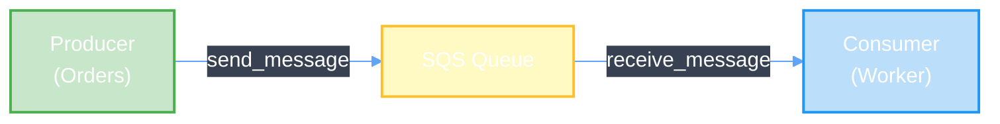
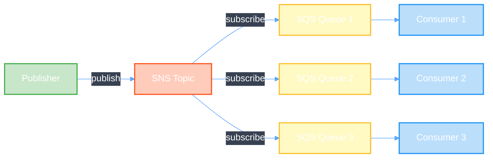
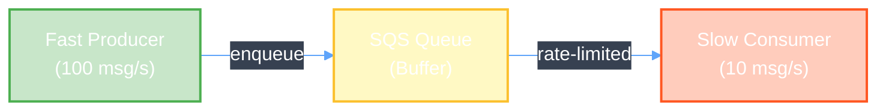

Filas de mensagens gerenciadas, escaláveis e duráveis para comunicação assíncrona entre componentes da sua aplicação.

## Pré-requisito: Configuração do AWSProvider

Antes de criar qualquer recurso AWS, você precisa configurar um **AWSProvider** que gerencia as credenciais e autenticação com a AWS.

<CodeGroup>
```yaml IRSA
apiVersion: infra.operator.aws.io/v1alpha1
kind: AWSProvider
metadata:
  name: production-aws
  namespace: default
spec:
  region: us-east-1
  roleARN: arn:aws:iam::123456789012:role/infra-operator-role
  defaultTags:
    managed-by: infra-operator
    environment: production
```

```yaml Credenciais Estáticas
apiVersion: v1
kind: Secret
metadata:
  name: aws-credentials
  namespace: default
type: Opaque
stringData:
  access-key-id: test
  secret-access-key: test
---
apiVersion: infra.operator.aws.io/v1alpha1
kind: AWSProvider
metadata:
  name: localstack
  namespace: default
spec:
  region: us-east-1
  accessKeyIDRef:
    name: aws-credentials
    key: access-key-id
  secretAccessKeyRef:
    name: aws-credentials
    key: secret-access-key
  defaultTags:
    managed-by: infra-operator
    environment: test
```

```bash Verificar Status
kubectl get awsprovider
kubectl describe awsprovider production-aws
```
</CodeGroup>

<Warning>
  Para produção, sempre use **IRSA** (IAM Roles for Service Accounts) ao invés de credenciais estáticas.
</Warning>

### Criar IAM Role para IRSA

Para usar IRSA em produção, você precisa criar uma IAM Role com as permissões necessárias:

<CodeGroup>
```json Trust Policy (trust-policy.json)
{
  "Version": "2012-10-17",
  "Statement": [
    {
      "Effect": "Allow",
      "Principal": {
        "Federated": "arn:aws:iam::123456789012:oidc-provider/oidc.eks.us-east-1.amazonaws.com/id/EXAMPLED539D4633E53DE1B71EXAMPLE"
      },
      "Action": "sts:AssumeRoleWithWebIdentity",
      "Condition": {
        "StringEquals": {
          "oidc.eks.us-east-1.amazonaws.com/id/EXAMPLED539D4633E53DE1B71EXAMPLE:sub": "system:serviceaccount:infra-operator-system:infra-operator-controller-manager",
          "oidc.eks.us-east-1.amazonaws.com/id/EXAMPLED539D4633E53DE1B71EXAMPLE:aud": "sts.amazonaws.com"
        }
      }
    }
  ]
}
```

```json IAM Policy - SQS (sqs-policy.json)
{
  "Version": "2012-10-17",
  "Statement": [
    {
      "Effect": "Allow",
      "Action": [
        "sqs:CreateQueue",
        "sqs:DeleteQueue",
        "sqs:GetQueueAttributes",
        "sqs:SetQueueAttributes",
        "sqs:TagQueue",
        "sqs:UntagQueue",
        "sqs:ListQueueTags"
      ],
      "Resource": "*"
    }
  ]
}
```

```bash Criar Role com AWS CLI
# 1. Obter OIDC Provider do cluster EKS
export CLUSTER_NAME=my-cluster
export AWS_REGION=us-east-1
export AWS_ACCOUNT_ID=$(aws sts get-caller-identity --query Account --output text)

OIDC_PROVIDER=$(aws eks describe-cluster \
  --name $CLUSTER_NAME \
  --region $AWS_REGION \
  --query "cluster.identity.oidc.issuer" \
  --output text | sed -e "s/^https:\/\///")

# 2. Atualizar trust-policy.json com valores corretos
cat > trust-policy.json <<EOF
{
  "Version": "2012-10-17",
  "Statement": [
    {
      "Effect": "Allow",
      "Principal": {
        "Federated": "arn:aws:iam::${AWS_ACCOUNT_ID}:oidc-provider/${OIDC_PROVIDER}"
      },
      "Action": "sts:AssumeRoleWithWebIdentity",
      "Condition": {
        "StringEquals": {
          "${OIDC_PROVIDER}:sub": "system:serviceaccount:infra-operator-system:infra-operator-controller-manager",
          "${OIDC_PROVIDER}:aud": "sts.amazonaws.com"
        }
      }
    }
  ]
}
EOF

# 3. Criar IAM Role
aws iam create-role \
  --role-name infra-operator-sqs-role \
  --assume-role-policy-document file://trust-policy.json \
  --description "Role for Infra Operator SQS management"

# 4. Criar e anexar policy
aws iam put-role-policy \
  --role-name infra-operator-sqs-role \
  --policy-name SQSManagement \
  --policy-document file://sqs-policy.json

# 5. Obter ARN da Role
aws iam get-role \
  --role-name infra-operator-sqs-role \
  --query 'Role.Arn' \
  --output text
```

```bash Anotar ServiceAccount do Operator
# Adicionar annotation ao ServiceAccount do operator
kubectl annotate serviceaccount infra-operator-controller-manager \
  -n infra-operator-system \
  eks.amazonaws.com/role-arn=arn:aws:iam::123456789012:role/infra-operator-sqs-role
```
</CodeGroup>

<Note>
  Substitua `123456789012` pelo seu AWS Account ID e `EXAMPLED539D4633E53DE1B71EXAMPLE` pelo ID do seu OIDC provider.
</Note>

## Visão Geral

O Amazon SQS (Simple Queue Service) é um serviço de fila de mensagens totalmente gerenciado que desacopla componentes de aplicações distribuídas. Com SQS, você pode:

- Desacoplar componentes de aplicações distribuídas
- Processar mensagens de forma assíncrona
- Escalar automaticamente com base na carga
- Garantir durabilidade das mensagens com replicação
- Implementar padrões como producer-consumer e worker pools
- Integrar com Lambda e SNS

## Início Rápido

<CodeGroup>
```yaml Fila Standard Básica
apiVersion: infra.operator.aws.io/v1alpha1
kind: SQSQueue
metadata:
  name: e2e-test-queue
  namespace: default
spec:
  queueName: e2e-test-messages-queue
  providerRef:
    name: localstack
  delaySeconds: 0
  maximumMessageSize: 262144
  messageRetentionPeriod: 345600
  visibilityTimeout: 30
  receiveMessageWaitTimeSeconds: 10
  tags:
    Environment: test
    ManagedBy: infra-operator
  deletionPolicy: Delete
```

```yaml Fila com DLQ
# Primeiro criar a DLQ
apiVersion: infra.operator.aws.io/v1alpha1
kind: SQSQueue
metadata:
  name: e2e-dlq-queue
  namespace: default
spec:
  queueName: e2e-test-dlq
  providerRef:
    name: localstack
  messageRetentionPeriod: 1209600
  deletionPolicy: Delete
---
# Depois criar a fila principal com referência à DLQ
apiVersion: infra.operator.aws.io/v1alpha1
kind: SQSQueue
metadata:
  name: e2e-queue-with-dlq
  namespace: default
spec:
  queueName: e2e-test-main-queue
  providerRef:
    name: localstack
  visibilityTimeout: 60
  deadLetterQueue:
    targetArn: arn:aws:sqs:us-east-1:000000000000:e2e-test-dlq
    maxReceiveCount: 3
  tags:
    Application: test-app
    Team: platform
  deletionPolicy: Delete
```

```yaml Fila FIFO
apiVersion: infra.operator.aws.io/v1alpha1
kind: SQSQueue
metadata:
  name: e2e-fifo-queue
  namespace: default
spec:
  queueName: e2e-test-fifo.fifo
  providerRef:
    name: localstack
  fifoQueue: true
  contentBasedDeduplication: true
  tags:
    Type: FIFO
    Environment: test
  deletionPolicy: Delete
```

```bash Aplicar
kubectl apply -f sqs-queue.yaml
```

```bash Verificar Status
kubectl get sqsqueues
kubectl describe sqsqueue e2e-test-queue
kubectl get sqsqueue e2e-test-queue -o yaml
```

```bash Acompanhar Criação
kubectl get sqsqueue e2e-test-queue -w
```
</CodeGroup>

## Referência de Configuração

### Campos Obrigatórios

<ParamField path="spec.providerRef" type="object" required>
  Referência ao recurso AWSProvider que gerencia a autenticação AWS

  <Expandable title="properties">
    <ParamField path="name" type="string" required>
      Nome do recurso AWSProvider a ser utilizado
    </ParamField>
  </Expandable>
</ParamField>

<ParamField path="spec.queueName" type="string" required>
  Nome da fila SQS

  **Requisitos:**
  - Standard queue: Nome entre 1-80 caracteres
  - FIFO queue: Nome deve terminar com `.fifo`, entre 1-80 caracteres
  - Apenas caracteres alfanuméricos, hífens e sublinhados
  - Exemplo: `orders-processing` ou `payments.fifo`

  <Note>O nome deve ser único dentro da região AWS</Note>
</ParamField>

### Campos Opcionais

<ParamField path="spec.fifoQueue" type="boolean" default="false">
  Se `true`, cria uma fila FIFO (First-In-First-Out) com garantia de ordem de processamento

  **Implicações:**
  - FIFO: Ordem garantida, mas menor throughput (~300 msg/s)
  - Standard: Melhor throughput (ilimitado), mas sem garantia de ordem

  **Use FIFO quando:** Ordem de processamento é crítica (pagamentos, transações)
</ParamField>

<ParamField path="spec.contentBasedDeduplication" type="boolean" default="false">
  Para filas FIFO, habilita deduplicação baseada no hash do conteúdo da mensagem

  <Note>Somente aplicável quando `fifoQueue: true`</Note>
</ParamField>

<ParamField path="spec.messageRetentionPeriod" type="integer" default="345600">
  Período de retenção de mensagens em segundos (padrão: 4 dias / 345.600 segundos)

  **Intervalo válido:** 60 segundos a 1.209.600 segundos (14 dias)

  **Exemplos:**
  - 60: 1 minuto
  - 300: 5 minutos
  - 3600: 1 hora
  - 86400: 1 dia
  - 345600: 4 dias (padrão)
  - 1209600: 14 dias (máximo)
</ParamField>

<ParamField path="spec.visibilityTimeout" type="integer" default="30">
  Tempo em segundos que uma mensagem fica invisível após ser consumida

  **Intervalo válido:** 0 a 43.200 segundos (12 horas)

  **Guia de configuração:**
  - Defina como 6x o tempo máximo esperado de processamento
  - Se processamento leva 10s, use 60s de timeout
  - Timeout muito curto: mensagens reprocessadas múltiplas vezes
  - Timeout muito longo: lenta recuperação em caso de falha
</ParamField>

<ParamField path="spec.receiveMessageWaitTimeSeconds" type="integer" default="0">
  Tempo em segundos para long polling quando não há mensagens

  **Intervalo válido:** 0 a 20 segundos

  **Benefícios do long polling:**
  - Reduz custos de API (menos requisições vazias)
  - Reduz latência (resposta imediata quando mensagem chega)
  - 20s é o máximo permitido

  **Recomendação:** Use 20 em produção
</ParamField>

<ParamField path="spec.delaySeconds" type="integer" default="0">
  Tempo de atraso antes que a mensagem fique visível na fila

  **Intervalo válido:** 0 a 900 segundos (15 minutos)

  **Uso:** Agendar processamento futuro de mensagens
</ParamField>

<ParamField path="spec.maximumMessageSize" type="integer" default="262144">
  Tamanho máximo de uma mensagem em bytes

  **Intervalo válido:** 1.024 a 262.144 bytes (256 KB)

  **Padrão:** 262.144 bytes (256 KB)
</ParamField>

<ParamField path="spec.deadLetterQueue" type="object">
  Configuração de fila de letra morta (DLQ) para mensagens que não puderam ser processadas

  <Expandable title="properties">
    <ParamField path="targetArn" type="string" required>
      ARN da fila DLQ de destino

      Exemplo: `arn:aws:sqs:us-east-1:123456789012:orders-dlq`

      <Note>A fila DLQ deve existir antes de referenciar</Note>
    </ParamField>

    <ParamField path="maxReceiveCount" type="integer" required>
      Número máximo de tentativas de consumo antes de enviar para DLQ

      **Intervalo válido:** 1 a 1.000

      **Recomendação:** 3 para a maioria dos casos
    </ParamField>
  </Expandable>

  **Importância:** DLQ é essencial para rastrear mensagens problemáticas
</ParamField>

<ParamField path="spec.kmsKeyId" type="string">
  ID ou ARN da chave AWS KMS para criptografia de mensagens em repouso

  Exemplo: `arn:aws:kms:us-east-1:123456789012:key/12345678-1234-1234-1234-123456789012`

  **Quando usar:**
  - Dados sensíveis (informações financeiras, PII)
  - Conformidade com regulamentações (HIPAA, PCI-DSS)
  - Produção com dados críticos
</ParamField>

<ParamField path="spec.tags" type="object">
  Pares chave-valor para marcar e categorizar a fila

  ```yaml
  tags:
    Environment: production
    Application: order-service
    Team: backend
    CostCenter: engineering
  ```
</ParamField>

<ParamField path="spec.deletionPolicy" type="string" default="Delete">
  Política para quando o CustomResource é deletado

  **Opções:**
  - `Delete`: Fila é deletada da AWS
  - `Retain`: Fila permanece na AWS mas não gerenciada
  - `Orphan`: Fila permanece e ownership do CR é removida

  **Recomendação:** Use `Retain` em produção
</ParamField>

## Campos de Status

Após a fila SQS ser criada, os seguintes campos de status são populados:

<ResponseField name="status.queueUrl" type="string">
  URL da fila SQS para envio/recebimento de mensagens

  Exemplo: `https://sqs.us-east-1.amazonaws.com/123456789012/orders-processing`
</ResponseField>

<ResponseField name="status.queueArn" type="string">
  ARN (Amazon Resource Name) da fila

  Exemplo: `arn:aws:sqs:us-east-1:123456789012:orders-processing`
</ResponseField>

<ResponseField name="status.approximateNumberOfMessages" type="integer">
  Número aproximado de mensagens disponíveis na fila
</ResponseField>

<ResponseField name="status.approximateNumberOfMessagesNotVisible" type="integer">
  Número aproximado de mensagens em processamento (invisíveis)
</ResponseField>

<ResponseField name="status.approximateNumberOfMessagesDelayed" type="integer">
  Número aproximado de mensagens agendadas/atrasadas
</ResponseField>

<ResponseField name="status.ready" type="boolean">
  `true` quando a fila está criada e pronta para uso
</ResponseField>

<ResponseField name="status.lastSyncTime" type="string">
  Timestamp da última sincronização com a AWS
</ResponseField>

## Exemplos

### Fila Standard para Alta Throughput

Fila simples otimizada para processamento rápido de alto volume:

```yaml
apiVersion: infra.operator.aws.io/v1alpha1
kind: SQSQueue
metadata:
  name: event-stream-queue
  namespace: default
spec:
  providerRef:
    name: production-aws

  # Fila Standard para melhor throughput
  queueName: event-stream-processing

  # Retenção curta para eventos temporários
  messageRetentionPeriod: 86400  # 1 dia

  # Timeout ajustado para processamento rápido
  visibilityTimeout: 10

  # Long polling para eficiência
  receiveMessageWaitTimeSeconds: 20

  tags:
    Environment: production
    Type: event-stream
    Throughput: high

  # Deletar fila ao fazer cleanup (é efêmera)
  deletionPolicy: Delete
```

### Fila FIFO com Garantia de Ordem

Fila FIFO para processamento sequencial (ex: transações):

```yaml
apiVersion: infra.operator.aws.io/v1alpha1
kind: SQSQueue
metadata:
  name: payment-transactions-queue
  namespace: default
spec:
  providerRef:
    name: production-aws

  # Nome FIFO
  queueName: payment-transactions.fifo

  # Habilitar FIFO
  fifoQueue: true

  # Deduplicação automática
  contentBasedDeduplication: true

  # Retenção longa para auditoria
  messageRetentionPeriod: 1209600  # 14 dias

  # Timeout maior para processamento de transação
  visibilityTimeout: 120

  # Long polling
  receiveMessageWaitTimeSeconds: 20

  # Máximo 1000 tps para FIFO
  maximumMessageSize: 262144

  tags:
    Environment: production
    Type: financial-transactions
    Compliance: required
    CriticalData: "true"

  # Manter fila em produção
  deletionPolicy: Retain
```

### Fila com Dead Letter Queue (DLQ)

Configuração robusta com handling de falhas:

```yaml
# Primeiro, criar a fila DLQ
apiVersion: infra.operator.aws.io/v1alpha1
kind: SQSQueue
metadata:
  name: order-processing-dlq
  namespace: default
spec:
  providerRef:
    name: production-aws
  queueName: order-processing-dlq
  messageRetentionPeriod: 1209600  # 14 dias para investigação
  visibilityTimeout: 300
  tags:
    Environment: production
    Type: dlq
    Parent: order-processing
  deletionPolicy: Retain

---
# Depois, criar a fila principal com DLQ configurada
apiVersion: infra.operator.aws.io/v1alpha1
kind: SQSQueue
metadata:
  name: order-processing-queue
  namespace: default
spec:
  providerRef:
    name: production-aws
  queueName: order-processing

  messageRetentionPeriod: 345600  # 4 dias
  visibilityTimeout: 60
  receiveMessageWaitTimeSeconds: 20

  # Configurar DLQ
  deadLetterQueue:
    # Usar ARN da DLQ criada acima
    targetArn: arn:aws:sqs:us-east-1:123456789012:order-processing-dlq
    # Enviar para DLQ após 3 tentativas
    maxReceiveCount: 3

  tags:
    Environment: production
    Application: order-service
    HasDLQ: "true"

  deletionPolicy: Retain
```

### Fila com Criptografia KMS

Fila com dados sensíveis criptografados em repouso:

```yaml
apiVersion: infra.operator.aws.io/v1alpha1
kind: SQSQueue
metadata:
  name: sensitive-data-queue
  namespace: default
spec:
  providerRef:
    name: production-aws

  queueName: sensitive-data-processing

  # Criptografia KMS para dados sensíveis
  kmsKeyId: arn:aws:kms:us-east-1:123456789012:key/12345678-1234-1234-1234-123456789012

  messageRetentionPeriod: 86400
  visibilityTimeout: 45
  receiveMessageWaitTimeSeconds: 20

  deadLetterQueue:
    targetArn: arn:aws:sqs:us-east-1:123456789012:sensitive-data-dlq
    maxReceiveCount: 2

  tags:
    Environment: production
    DataClassification: confidential
    Encryption: kms-required
    Compliance: hipaa-pci-dss

  deletionPolicy: Retain
```

## Verificação

### Verificar Status da Fila

```bash
# Listar todas as filas SQS
kubectl get sqsqueues

# Obter informações detalhadas da fila
kubectl get sqsqueue order-queue -o yaml

# Acompanhar criação da fila
kubectl get sqsqueue order-queue -w

# Verificar eventos de criação
kubectl describe sqsqueue order-queue
```

### Verificar na AWS

<Tabs>
  <Tab title="AWS CLI">
    ```bash
    # Listar filas
    aws sqs list-queues --region us-east-1

    # Obter atributos da fila
    aws sqs get-queue-attributes \
      --queue-url https://sqs.us-east-1.amazonaws.com/123456789012/orders-processing \
      --attribute-names All \
      --region us-east-1

    # Obter contagem aproximada de mensagens
    aws sqs get-queue-attributes \
      --queue-url https://sqs.us-east-1.amazonaws.com/123456789012/orders-processing \
      --attribute-names ApproximateNumberOfMessages \
      --region us-east-1

    # Enviar mensagem de teste
    aws sqs send-message \
      --queue-url https://sqs.us-east-1.amazonaws.com/123456789012/orders-processing \
      --message-body '{"order_id": "12345", "status": "test"}' \
      --region us-east-1
    ```
  </Tab>

  <Tab title="LocalStack">
    ```bash
    # Para testes com LocalStack
    export AWS_ENDPOINT_URL=http://localhost:4566
    export AWS_REGION=us-east-1

    # Listar filas
    aws sqs list-queues

    # Obter atributos
    aws sqs get-queue-attributes \
      --queue-url http://localhost:4566/000000000000/orders-processing \
      --attribute-names All
    ```
  </Tab>

  <Tab title="AWS Console">
    1. Acesse AWS Management Console
    2. Vá para SQS
    3. Procure a fila por nome
    4. Abra a fila para ver detalhes
    5. Monitore: Messages available, In flight, Delayed
  </Tab>
</Tabs>

### Saída Esperada

```yaml
status:
  queueUrl: https://sqs.us-east-1.amazonaws.com/123456789012/orders-processing
  queueArn: arn:aws:sqs:us-east-1:123456789012:orders-processing
  approximateNumberOfMessages: 42
  approximateNumberOfMessagesNotVisible: 5
  approximateNumberOfMessagesDelayed: 0
  ready: true
  lastSyncTime: "2025-11-22T20:18:08Z"
```

## Resolução de Problemas

<AccordionGroup>
  <Accordion title="Fila travada em estado pending">
    **Sintomas:** Fila `ready: false` por mais de 2 minutos

    **Causas comuns:**
    1. Credenciais AWSProvider inválidas
    2. Problemas de conectividade de rede
    3. Nome de fila já existe na conta AWS
    4. Limitação de taxa da API AWS

    **Soluções:**
    ```bash
    # Verificar status do AWSProvider
    kubectl describe awsprovider production-aws

    # Verificar logs do controller
    kubectl logs -n infra-operator-system \
      deploy/infra-operator-controller-manager \
      --tail=100

    # Verificar eventos da fila
    kubectl describe sqsqueue order-queue

    # Verificar se fila existe na AWS
    aws sqs list-queues --query 'QueueUrls' | grep orders-processing
    ```
  </Accordion>

  <Accordion title="Mensagens não sendo processadas">
    **Sintomas:** `approximateNumberOfMessages` cresce indefinidamente

    **Causas comuns:**
    1. Consumidor da fila está offline
    2. Visibility timeout muito curto (mensagem retorna rápido)
    3. Consumidor com erro que previne delete
    4. Política de DLQ enviando para DLQ prematuramente

    **Soluções:**
    ```bash
    # Verificar número de mensagens
    aws sqs get-queue-attributes \
      --queue-url <QUEUE_URL> \
      --attribute-names ApproximateNumberOfMessages

    # Aumentar visibility timeout se necessário
    kubectl patch sqsqueue order-queue --type merge -p \
      '{"spec":{"visibilityTimeout": 120}}'

    # Verificar consumidor está rodando
    kubectl get pods -l app=order-consumer
    kubectl logs -l app=order-consumer --tail=50
    ```
  </Accordion>

  <Accordion title="DLQ enchendo com mensagens">
    **Sintomas:** DLQ cresce mas não há ação

    **Causas comuns:**
    1. Consumidor não implementou retry logic corretamente
    2. Mensagens malformadas ou inválidas
    3. Dependência externa (banco de dados, API) offline
    4. maxReceiveCount muito baixo

    **Soluções:**
    ```bash
    # Receber mensagem da DLQ para investigação
    aws sqs receive-message \
      --queue-url <DLQ_URL> \
      --attribute-names All \
      --message-attribute-names All

    # Aumentar maxReceiveCount se apropriado
    kubectl patch sqsqueue order-queue --type merge -p \
      '{"spec":{"deadLetterQueue":{"maxReceiveCount": 5}}}'

    # Purgar DLQ após correção
    aws sqs purge-queue --queue-url <DLQ_URL>
    ```
  </Accordion>

  <Accordion title="Visibilidade Timeout muito curto/longo">
    **Sintomas:**
    - Muito curto: Mensagens duplicadas em processamento
    - Muito longo: Lenta recuperação de falhas

    **Solução:**
    ```bash
    # Medir tempo de processamento
    # Fórmula: visibilityTimeout = 6 × tempo_máximo_processamento

    # Se processamento leva até 30 segundos:
    kubectl patch sqsqueue order-queue --type merge -p \
      '{"spec":{"visibilityTimeout": 180}}'  # 30s × 6
    ```
  </Accordion>

  <Accordion title="Mensagens duplicadas em Standard Queue">
    **Sintomas:** Mensagens processadas múltiplas vezes

    **Causa:** Standard Queue não garante deduplicação

    **Soluções:**
    1. Implementar deduplicação no consumidor (usar message ID ou idempotency key)
    2. Usar FIFO Queue se ordem é importante
    3. Implementar database idempotency (única constraint)

    ```yaml
    # Migrar para FIFO se ordem é crítica
    spec:
      queueName: orders.fifo
      fifoQueue: true
      contentBasedDeduplication: true
    ```
  </Accordion>

  <Accordion title="Fila FIFO com problemas de throughput">
    **Sintomas:** Mensagens enfileiradas, não processadas rápido

    **Causa:** FIFO queues têm limite de ~300 mensagens/segundo

    **Soluções:**
    1. Usar `MessageGroupId` para paralelizar em múltiplos grupos
    2. Aumentar número de consumers por grupo
    3. Considerar usar Standard Queue se ordem não é crítica

    ```bash
    # Enviar mensagens em diferentes MessageGroupIds
    aws sqs send-message \
      --queue-url <QUEUE_URL> \
      --message-body 'message' \
      --message-group-id 'group-1'  # Diferentes valores para paralelismo
    ```
  </Accordion>

  <Accordion title="Erro ao referenciar DLQ">
    **Erro:** `DLQ target ARN does not exist`

    **Causa:** Fila DLQ não foi criada antes

    **Solução:**
    ```bash
    # Criar DLQ primeiro
    kubectl apply -f dlq.yaml

    # Esperar DLQ estar pronta
    kubectl get sqsqueue order-processing-dlq -w

    # Depois criar fila principal com referência DLQ
    kubectl apply -f order-queue.yaml
    ```
  </Accordion>
</AccordionGroup>

## Melhores Práticas

<CardGroup cols={2}>
  <Card title="Sempre Configure DLQ" icon="skull">
    - Dead Letter Queue é essencial para produção
    - Permite rastrear e investigar falhas
    - Configure `maxReceiveCount` baseado em SLA
    - Monitore DLQ continuamente
  </Card>

  <Card title="Use Long Polling" icon="arrow-down">
    - `receiveMessageWaitTimeSeconds: 20`
    - Reduz custos de API (menos requisições vazias)
    - Reduz latência de entrega
    - Configure máximo (20s) em produção
  </Card>

  <Card title="Visibility Timeout Correto" icon="hourglass">
    - Fórmula: 6 × tempo máximo de processamento
    - Se processamento leva 10s, use 60s
    - Muito curto: duplicação de processamento
    - Muito longo: lenta detecção de falhas
  </Card>

  <Card title="FIFO vs Standard" icon="arrows">
    - **FIFO**: Use quando ordem importa (transações, pagamentos)
    - **Standard**: Use para eventos, logs, alta throughput
    - FIFO: ~300 msg/s, Standard: ilimitado
    - FIFO: Maior latência, Standard: menor latência
  </Card>

  <Card title="Criptografia em Produção" icon="lock">
    - Use KMS para dados sensíveis (financeiro, PII)
    - Conformidade com HIPAA, PCI-DSS, GDPR
    - Custo mínimo adicional
    - Configure policies de acesso à chave
  </Card>

  <Card title="Retenção Apropriada" icon="calendar">
    - Eventos: 1-4 dias
    - Transações: 7-14 dias (auditoria)
    - Logs: 1-7 dias
    - Padrão: 4 dias
  </Card>

  <Card title="Tags e Governança" icon="tags">
    - Sempre marque com `Environment`
    - Inclua `Application` para rastreabilidade
    - Adicione `CostCenter` para chargeback
    - Use `DataClassification` para segurança
  </Card>

  <Card title="Política de Deleção" icon="shield-halved">
    - Use `Retain` para produção (dados críticos)
    - Use `Delete` para dev/test (cleanup automático)
    - Documente políticas por ambiente
    - Backup de configurações em Git
  </Card>

  <Card title="Tratamento de Erros" icon="triangle-exclamation">
    - Implementar exponential backoff no consumidor
    - DLQ para mensagens não processáveis
    - Logging estruturado de falhas
    - Alertas no DLQ não vazio
  </Card>
</CardGroup>

## Padrões de Integração

### Producer-Consumer Simples

Aplicação publicadora envia mensagens, workers consomem:



**Implementação:**
- Producer: `send_message()` para enfileirar
- Consumer: `receive_message()` em loop com long polling
- Delete: `delete_message()` após processamento bem-sucedido

### Fan-Out com SNS + SQS

Mensagem publicada para múltiplas filas via SNS:



**Caso de uso:** Uma ação dispara múltiplos workflows

### Backpressure Handling

Controlando taxa de processamento com visibilityTimeout:



**Controle:**
- Aumentar `visibilityTimeout` desacelera reprocessamento
- Implementar exponential backoff no consumidor
- Escalar número de consumers para aumentar throughput

## Recursos Relacionados

<CardGroup cols={2}>
  <Card
    title="SNS Topic"
    icon="bullhorn"
    href="/services/messaging/sns"
  >
    Integre com SNS para pub/sub fan-out
  </Card>

  <Card
    title="Lambda"
    icon="lambda"
    href="/services/compute/lambda"
  >
    Processe mensagens com funções serverless
  </Card>

</CardGroup>
