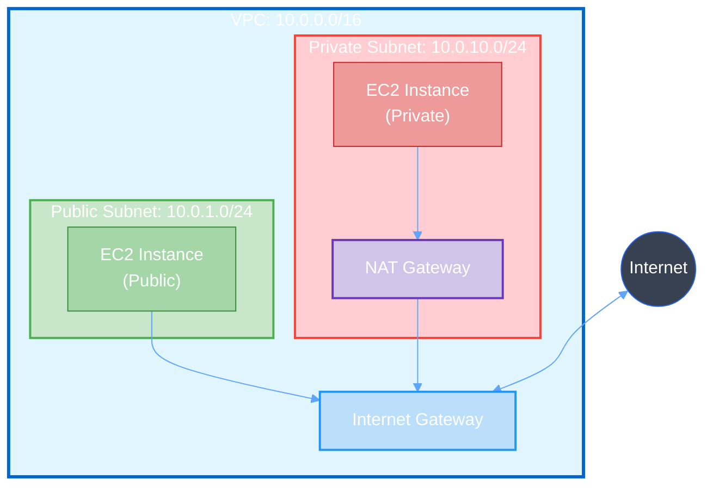

Forneça acesso à internet para recursos em subnets públicas da VPC.

## Pré-requisito: Configuração do AWSProvider

Antes de criar qualquer recurso AWS, você precisa configurar um **AWSProvider** que gerencia as credenciais e autenticação com a AWS.

<CodeGroup>
```yaml IRSA
apiVersion: infra.operator.aws.io/v1alpha1
kind: AWSProvider
metadata:
  name: production-aws
  namespace: default
spec:
  region: us-east-1
  roleARN: arn:aws:iam::123456789012:role/infra-operator-role
  defaultTags:
    managed-by: infra-operator
    environment: production
```

```yaml Credenciais Estáticas
apiVersion: v1
kind: Secret
metadata:
  name: aws-credentials
  namespace: default
type: Opaque
stringData:
  access-key-id: test
  secret-access-key: test
---
apiVersion: infra.operator.aws.io/v1alpha1
kind: AWSProvider
metadata:
  name: localstack
  namespace: default
spec:
  region: us-east-1
  accessKeyIDRef:
    name: aws-credentials
    key: access-key-id
  secretAccessKeyRef:
    name: aws-credentials
    key: secret-access-key
  defaultTags:
    managed-by: infra-operator
    environment: test
```

```bash Verificar Status
kubectl get awsprovider
kubectl describe awsprovider production-aws
```
</CodeGroup>

<Warning>
  Para produção, sempre use **IRSA** (IAM Roles for Service Accounts) ao invés de credenciais estáticas.
</Warning>

### Criar IAM Role para IRSA

Para usar IRSA em produção, você precisa criar uma IAM Role com as permissões necessárias:

<CodeGroup>
```json Trust Policy (trust-policy.json)
{
  "Version": "2012-10-17",
  "Statement": [
    {
      "Effect": "Allow",
      "Principal": {
        "Federated": "arn:aws:iam::123456789012:oidc-provider/oidc.eks.us-east-1.amazonaws.com/id/EXAMPLED539D4633E53DE1B71EXAMPLE"
      },
      "Action": "sts:AssumeRoleWithWebIdentity",
      "Condition": {
        "StringEquals": {
          "oidc.eks.us-east-1.amazonaws.com/id/EXAMPLED539D4633E53DE1B71EXAMPLE:sub": "system:serviceaccount:infra-operator-system:infra-operator-controller-manager",
          "oidc.eks.us-east-1.amazonaws.com/id/EXAMPLED539D4633E53DE1B71EXAMPLE:aud": "sts.amazonaws.com"
        }
      }
    }
  ]
}
```

```json IAM Policy - Internet Gateway (igw-policy.json)
{
  "Version": "2012-10-17",
  "Statement": [
    {
      "Effect": "Allow",
      "Action": [
        "ec2:CreateInternetGateway",
        "ec2:DeleteInternetGateway",
        "ec2:DescribeInternetGateways",
        "ec2:AttachInternetGateway",
        "ec2:DetachInternetGateway",
        "ec2:CreateTags",
        "ec2:DeleteTags",
        "ec2:DescribeTags"
      ],
      "Resource": "*"
    }
  ]
}
```

```bash Criar Role com AWS CLI
# 1. Obter OIDC Provider do cluster EKS
export CLUSTER_NAME=my-cluster
export AWS_REGION=us-east-1
export AWS_ACCOUNT_ID=$(aws sts get-caller-identity --query Account --output text)

OIDC_PROVIDER=$(aws eks describe-cluster \
  --name $CLUSTER_NAME \
  --region $AWS_REGION \
  --query "cluster.identity.oidc.issuer" \
  --output text | sed -e "s/^https:\/\///")

# 2. Atualizar trust-policy.json com valores corretos
cat > trust-policy.json <<EOF
{
  "Version": "2012-10-17",
  "Statement": [
    {
      "Effect": "Allow",
      "Principal": {
        "Federated": "arn:aws:iam::${AWS_ACCOUNT_ID}:oidc-provider/${OIDC_PROVIDER}"
      },
      "Action": "sts:AssumeRoleWithWebIdentity",
      "Condition": {
        "StringEquals": {
          "${OIDC_PROVIDER}:sub": "system:serviceaccount:infra-operator-system:infra-operator-controller-manager",
          "${OIDC_PROVIDER}:aud": "sts.amazonaws.com"
        }
      }
    }
  ]
}
EOF

# 3. Criar IAM Role
aws iam create-role \
  --role-name infra-operator-igw-role \
  --assume-role-policy-document file://trust-policy.json \
  --description "Role for Infra Operator Internet Gateway management"

# 4. Criar e anexar policy
aws iam put-role-policy \
  --role-name infra-operator-igw-role \
  --policy-name InternetGatewayManagement \
  --policy-document file://igw-policy.json

# 5. Obter ARN da Role
aws iam get-role \
  --role-name infra-operator-igw-role \
  --query 'Role.Arn' \
  --output text
```

```bash Anotar ServiceAccount do Operator
# Adicionar annotation ao ServiceAccount do operator
kubectl annotate serviceaccount infra-operator-controller-manager \
  -n infra-operator-system \
  eks.amazonaws.com/role-arn=arn:aws:iam::123456789012:role/infra-operator-igw-role
```
</CodeGroup>

<Note>
  Substitua `123456789012` pelo seu AWS Account ID e `EXAMPLED539D4633E53DE1B71EXAMPLE` pelo ID do seu OIDC provider.
</Note>

## Visão Geral

Um Internet Gateway (IGW) é um componente da VPC que permite comunicação entre recursos na VPC e a internet. É horizontalmente escalável, redundante e altamente disponível por design.

**Características:**
- Permite tráfego de saída (egress) para internet
- Permite tráfego de entrada (ingress) da internet
- Suporta IPv4 e IPv6
- Sem custo adicional (apenas tráfego de dados)
- Um IGW por VPC

## Início Rápido

<CodeGroup>
```yaml Internet Gateway Básico
apiVersion: infra.operator.aws.io/v1alpha1
kind: InternetGateway
metadata:
  name: e2e-igw
  namespace: default
spec:
  providerRef:
    name: localstack
  vpcID: REPLACE_WITH_VPC_ID
  tags:
    Name: e2e-internet-gateway
    ManagedBy: infra-operator
  deletionPolicy: Delete
```

```yaml Internet Gateway de Produção
apiVersion: infra.operator.aws.io/v1alpha1
kind: InternetGateway
metadata:
  name: production-igw
  namespace: default
spec:
  providerRef:
    name: production-aws
  vpcID: vpc-0a1b2c3d4e5f6g7h8
  tags:
    Name: production-internet-gateway
    Environment: production
    ManagedBy: infra-operator
    CostCenter: networking
  deletionPolicy: Retain
```

```bash Aplicar
kubectl apply -f internet-gateway.yaml
```

```bash Verificar Status
kubectl get internetgateway
kubectl describe internetgateway e2e-igw
```
</CodeGroup>

## Referência de Configuração

### Campos Obrigatórios

<ParamField path="spec.providerRef" type="object" required>
  Referência ao recurso AWSProvider

  <Expandable title="properties">
    <ParamField path="name" type="string" required>
      Nome do recurso AWSProvider
    </ParamField>
  </Expandable>
</ParamField>

<ParamField path="spec.vpcID" type="string" required>
  ID da VPC AWS onde o Internet Gateway será anexado (ex: `vpc-0a1b2c3d4e5f6g7h8`)

  <Note>
    Use `REPLACE_WITH_VPC_ID` durante deploy e substitua pelo ID real da VPC após sua criação, ou use o campo `status.vpcID` de um recurso VPC existente.
  </Note>
</ParamField>

### Campos Opcionais

<ParamField path="spec.tags" type="object">
  Pares chave-valor para marcar o Internet Gateway

  ```yaml
  tags:
    Name: production-igw
    Environment: production
    Team: platform
  ```
</ParamField>

<ParamField path="spec.deletionPolicy" type="string" default="Delete">
  O que acontece com o IGW quando o CR é deletado

  **Opções:**
  - `Delete`: IGW é deletado da AWS
  - `Retain`: IGW permanece na AWS mas não gerenciado
</ParamField>

## Campos de Status

Após o Internet Gateway ser criado, os seguintes campos de status são populados:

<ResponseField name="status.internetGatewayID" type="string">
  Identificador AWS do Internet Gateway (ex: `igw-0a1b2c3d4e5f6g7h8`)
</ResponseField>

<ResponseField name="status.vpcID" type="string">
  ID da VPC à qual o IGW está anexado
</ResponseField>

<ResponseField name="status.state" type="string">
  Estado do attachment do IGW
  - `attaching`: IGW está sendo anexado à VPC
  - `attached`: IGW está anexado e pronto para uso
  - `detaching`: IGW está sendo desanexado
  - `detached`: IGW foi desanexado
</ResponseField>

<ResponseField name="status.ready" type="boolean">
  `true` quando o IGW está anexado e pronto para uso
</ResponseField>

<ResponseField name="status.lastSyncTime" type="string">
  Timestamp da última sincronização com a AWS
</ResponseField>

## Exemplos

### Internet Gateway para Produção

```yaml
apiVersion: infra.operator.aws.io/v1alpha1
kind: InternetGateway
metadata:
  name: production-igw
  namespace: default
spec:
  providerRef:
    name: production-aws

  vpcID: vpc-0a1b2c3d4e5f6g7h8

  tags:
    Name: production-internet-gateway
    Environment: production
    ManagedBy: infra-operator
    CostCenter: networking

  # Manter IGW se CR for deletado
  deletionPolicy: Retain
```

### Internet Gateway para Desenvolvimento

```yaml
apiVersion: infra.operator.aws.io/v1alpha1
kind: InternetGateway
metadata:
  name: dev-igw
  namespace: default
spec:
  providerRef:
    name: localstack

  vpcID: vpc-f3ea9b1b36fce09cd

  tags:
    Name: development-internet-gateway
    Environment: development
    AutoShutdown: "true"

  # Deletar IGW ao fazer cleanup
  deletionPolicy: Delete
```

### Configuração Completa com VPC

<CodeGroup>
```yaml VPC
apiVersion: infra.operator.aws.io/v1alpha1
kind: VPC
metadata:
  name: app-vpc
  namespace: default
spec:
  providerRef:
    name: production-aws
  cidrBlock: "10.0.0.0/16"
  enableDnsSupport: true
  enableDnsHostnames: true
  tags:
    Name: application-vpc
  deletionPolicy: Delete
```

```yaml Internet Gateway
apiVersion: infra.operator.aws.io/v1alpha1
kind: InternetGateway
metadata:
  name: app-igw
  namespace: default
spec:
  providerRef:
    name: production-aws
  vpcID: REPLACE_WITH_VPC_ID
  tags:
    Name: application-igw
  deletionPolicy: Delete
```

```yaml Subnet Pública
apiVersion: infra.operator.aws.io/v1alpha1
kind: Subnet
metadata:
  name: app-public-subnet
  namespace: default
spec:
  providerRef:
    name: production-aws
  vpcID: REPLACE_WITH_VPC_ID
  cidrBlock: "10.0.1.0/24"
  availabilityZone: us-east-1a
  mapPublicIpOnLaunch: true
  tags:
    Name: public-subnet-1a
    Type: public
  deletionPolicy: Delete
```
</CodeGroup>

## Verificação

### Verificar Status do IGW

```bash
# Listar todos os Internet Gateways
kubectl get internetgateways

# Obter informações detalhadas
kubectl get internetgateway production-igw -o yaml

# Acompanhar criação
kubectl get internetgateway production-igw -w
```

### Verificar na AWS

<Tabs>
  <Tab title="AWS CLI">
    ```bash
    # Listar Internet Gateways
    aws ec2 describe-internet-gateways --internet-gateway-ids igw-xxx

    # Obter detalhes do IGW
    aws ec2 describe-internet-gateways \
      --internet-gateway-ids igw-xxx \
      --query 'InternetGateways[0]' \
      --output json
    ```
  </Tab>

  <Tab title="LocalStack">
    ```bash
    # Para testes com LocalStack
    export AWS_ENDPOINT_URL=http://localhost:4566

    aws ec2 describe-internet-gateways \
      --internet-gateway-ids igw-xxx
    ```
  </Tab>
</Tabs>

### Saída Esperada

```yaml
status:
  internetGatewayID: igw-0a1b2c3d4e5f6g7h8
  vpcID: vpc-f3ea9b1b36fce09cd
  state: attached
  ready: true
  lastSyncTime: "2025-11-22T20:30:15Z"
```

## Resolução de Problemas

<AccordionGroup>
  <Accordion title="IGW não anexa à VPC">
    **Sintomas:** IGW permanece em estado `attaching`

    **Causas comuns:**
    1. VPC não existe ou não está pronta
    2. Já existe outro IGW anexado à VPC
    3. Permissões IAM insuficientes

    **Soluções:**
    ```bash
    # Verificar se VPC existe e está pronta
    kubectl get vpc my-vpc

    # Verificar se já existe IGW na VPC
    aws ec2 describe-internet-gateways \
      --filters "Name=attachment.vpc-id,Values=vpc-xxx"

    # Verificar logs do controller
    kubectl logs -n infra-operator-system \
      deploy/infra-operator-controller-manager \
      --tail=100
    ```
  </Accordion>

  <Accordion title="VPC já tem IGW anexado">
    **Erro:** `"Resource has a dependency violation"`

    **Causa:** Uma VPC pode ter apenas um Internet Gateway anexado

    **Soluções:**
    1. Use o IGW existente
    2. Ou desanexe o IGW antigo antes de anexar novo

    ```bash
    # Listar IGWs na VPC
    aws ec2 describe-internet-gateways \
      --filters "Name=attachment.vpc-id,Values=vpc-xxx"
    ```
  </Accordion>

  <Accordion title="Deleção travada">
    **Sintomas:** Deleção do IGW demora ou trava

    **Causa:** IGW ainda tem dependências (route tables apontando para ele)

    **Soluções:**
    ```bash
    # Verificar route tables que usam o IGW
    aws ec2 describe-route-tables \
      --filters "Name=route.gateway-id,Values=igw-xxx"

    # Remover rotas antes de deletar IGW
    # (normalmente gerenciado automaticamente pelo operator)

    # Forçar deleção se necessário
    kubectl delete internetgateway my-igw --force --grace-period=0
    ```
  </Accordion>

  <Accordion title="Internet não funciona após criar IGW">
    **Sintomas:** Recursos na subnet pública não conseguem acessar internet

    **Causa:** Falta configurar route table

    **Soluções:**
    1. Verifique se a route table tem rota para 0.0.0.0/0 apontando para o IGW
    2. Verifique se a subnet está associada à route table correta
    3. Verifique security groups e NACLs

    ```bash
    # Verificar route tables
    aws ec2 describe-route-tables \
      --filters "Name=vpc-id,Values=vpc-xxx"
    ```
  </Accordion>
</AccordionGroup>

## Melhores Práticas

<CardGroup cols={2}>
  <Card title="Um IGW por VPC" icon="network-wired">
    - Uma VPC suporta apenas um IGW
    - Reutilize o mesmo IGW para todas as subnets públicas
    - Não crie múltiplos IGWs para a mesma VPC
  </Card>

  <Card title="Tagging Consistente" icon="tags">
    - Sempre marque com `Environment`
    - Inclua `ManagedBy: infra-operator`
    - Use tags para alocação de custos
    - Nomeie claramente (ex: prod-igw, dev-igw)
  </Card>

  <Card title="Route Tables" icon="route">
    - Configure route tables com rotas para o IGW
    - Rota: 0.0.0.0/0 → IGW (para IPv4)
    - Rota: ::/0 → IGW (para IPv6, se usado)
    - Associe subnets públicas à route table
  </Card>

  <Card title="Política de Deleção" icon="shield-halved">
    - Use `Retain` para IGWs de produção
    - Use `Delete` para ambientes temporários
    - Documente dependências (subnets, route tables)
    - Teste deleção em dev primeiro
  </Card>
</CardGroup>

## Arquitetura de Rede Pública



## Recursos Relacionados

<CardGroup cols={2}>
  <Card
    title="VPC"
    icon="network-wired"
    href="/services/networking/vpc"
  >
    Crie a VPC antes de criar o Internet Gateway
  </Card>

  <Card
    title="Subnet"
    icon="sitemap"
    href="/services/networking/subnet"
  >
    Configure subnets públicas para usar o IGW
  </Card>

  <Card
    title="NAT Gateway"
    icon="arrow-right-arrow-left"
    href="/services/networking/nat-gateway"
  >
    Para internet de saída de subnets privadas
  </Card>

  <Card
    title="Route Table"
    icon="route"
    href="/services/networking/route-table"
  >
    Configure rotas para direcionar tráfego ao IGW
  </Card>
</CardGroup>

---
