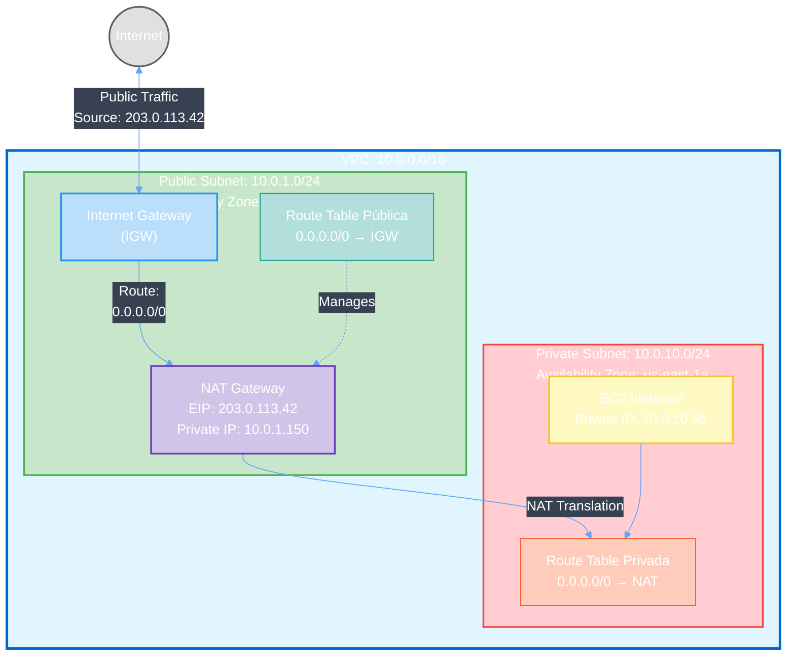
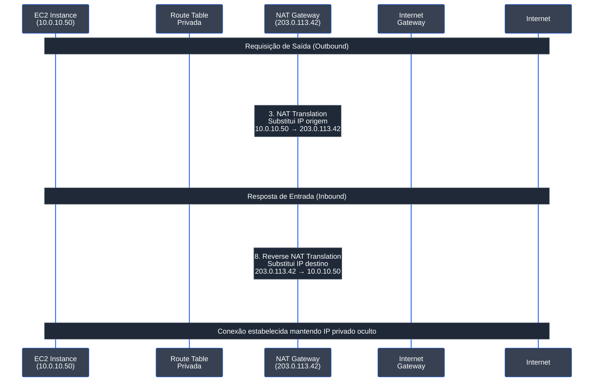

Permite que recursos em subnets privadas acessem a internet de forma segura, mantendo seus endereços IP privados protegidos.

## Pré-requisito: Configuração do AWSProvider

Antes de criar qualquer recurso AWS, você precisa configurar um **AWSProvider** que gerencia as credenciais e autenticação com a AWS.

<CodeGroup>
```yaml IRSA
apiVersion: infra.operator.aws.io/v1alpha1
kind: AWSProvider
metadata:
  name: production-aws
  namespace: default
spec:
  region: us-east-1
  roleARN: arn:aws:iam::123456789012:role/infra-operator-role
  defaultTags:
    managed-by: infra-operator
    environment: production
```

```yaml Credenciais Estáticas
apiVersion: v1
kind: Secret
metadata:
  name: aws-credentials
  namespace: default
type: Opaque
stringData:
  access-key-id: test
  secret-access-key: test
---
apiVersion: infra.operator.aws.io/v1alpha1
kind: AWSProvider
metadata:
  name: localstack
  namespace: default
spec:
  region: us-east-1
  accessKeyIDRef:
    name: aws-credentials
    key: access-key-id
  secretAccessKeyRef:
    name: aws-credentials
    key: secret-access-key
  defaultTags:
    managed-by: infra-operator
    environment: test
```

```bash Verificar Status
kubectl get awsprovider
kubectl describe awsprovider production-aws
```
</CodeGroup>

<Warning>
  Para produção, sempre use **IRSA** (IAM Roles for Service Accounts) ao invés de credenciais estáticas.
</Warning>

### Criar IAM Role para IRSA

Para usar IRSA em produção, você precisa criar uma IAM Role com as permissões necessárias:

<CodeGroup>
```json Trust Policy (trust-policy.json)
{
  "Version": "2012-10-17",
  "Statement": [
    {
      "Effect": "Allow",
      "Principal": {
        "Federated": "arn:aws:iam::123456789012:oidc-provider/oidc.eks.us-east-1.amazonaws.com/id/EXAMPLED539D4633E53DE1B71EXAMPLE"
      },
      "Action": "sts:AssumeRoleWithWebIdentity",
      "Condition": {
        "StringEquals": {
          "oidc.eks.us-east-1.amazonaws.com/id/EXAMPLED539D4633E53DE1B71EXAMPLE:sub": "system:serviceaccount:infra-operator-system:infra-operator-controller-manager",
          "oidc.eks.us-east-1.amazonaws.com/id/EXAMPLED539D4633E53DE1B71EXAMPLE:aud": "sts.amazonaws.com"
        }
      }
    }
  ]
}
```

```json IAM Policy - NAT Gateway (nat-gateway-policy.json)
{
  "Version": "2012-10-17",
  "Statement": [
    {
      "Effect": "Allow",
      "Action": [
        "ec2:CreateNatGateway",
        "ec2:DeleteNatGateway",
        "ec2:DescribeNatGateways",
        "ec2:AllocateAddress",
        "ec2:ReleaseAddress",
        "ec2:DescribeAddresses",
        "ec2:CreateTags",
        "ec2:DeleteTags",
        "ec2:DescribeTags"
      ],
      "Resource": "*"
    }
  ]
}
```

```bash Criar Role com AWS CLI
# 1. Obter OIDC Provider do cluster EKS
export CLUSTER_NAME=my-cluster
export AWS_REGION=us-east-1
export AWS_ACCOUNT_ID=$(aws sts get-caller-identity --query Account --output text)

OIDC_PROVIDER=$(aws eks describe-cluster \
  --name $CLUSTER_NAME \
  --region $AWS_REGION \
  --query "cluster.identity.oidc.issuer" \
  --output text | sed -e "s/^https:\/\///")

# 2. Atualizar trust-policy.json com valores corretos
cat > trust-policy.json <<EOF
{
  "Version": "2012-10-17",
  "Statement": [
    {
      "Effect": "Allow",
      "Principal": {
        "Federated": "arn:aws:iam::${AWS_ACCOUNT_ID}:oidc-provider/${OIDC_PROVIDER}"
      },
      "Action": "sts:AssumeRoleWithWebIdentity",
      "Condition": {
        "StringEquals": {
          "${OIDC_PROVIDER}:sub": "system:serviceaccount:infra-operator-system:infra-operator-controller-manager",
          "${OIDC_PROVIDER}:aud": "sts.amazonaws.com"
        }
      }
    }
  ]
}
EOF

# 3. Criar IAM Role
aws iam create-role \
  --role-name infra-operator-nat-role \
  --assume-role-policy-document file://trust-policy.json \
  --description "Role for Infra Operator NAT Gateway management"

# 4. Criar e anexar policy
aws iam put-role-policy \
  --role-name infra-operator-nat-role \
  --policy-name NATGatewayManagement \
  --policy-document file://nat-gateway-policy.json

# 5. Obter ARN da Role
aws iam get-role \
  --role-name infra-operator-nat-role \
  --query 'Role.Arn' \
  --output text
```

```bash Anotar ServiceAccount do Operator
# Adicionar annotation ao ServiceAccount do operator
kubectl annotate serviceaccount infra-operator-controller-manager \
  -n infra-operator-system \
  eks.amazonaws.com/role-arn=arn:aws:iam::123456789012:role/infra-operator-nat-role
```
</CodeGroup>

<Note>
  Substitua `123456789012` pelo seu AWS Account ID e `EXAMPLED539D4633E53DE1B71EXAMPLE` pelo ID do seu OIDC provider.
</Note>

## Visão Geral

Um NAT Gateway (Network Address Translation) permite que instâncias em subnets privadas iniciarem conexões de saída com a internet ou com outros serviços AWS, sem receber conexões de entrada inbound. O NAT Gateway mascara o endereço IP privado da instância, substituindo-o por seu próprio endereço IP elástico (EIP).

**Características:**
- Permite tráfego de saída (egress) para internet de subnets privadas
- Bloqueia tráfego de entrada (ingress) não solicitado
- Usa Elastic IP (EIP) para manter consistência
- Escalável automaticamente até 45 Gbps
- Suporta IPv4 nativamente
- Deve estar em subnet PÚBLICA
- Fornece logs de fluxo NAT
- Sem custo de criação, paga-se por uso de dados

## Início Rápido

<CodeGroup>
```yaml NAT Gateway Básico
apiVersion: infra.operator.aws.io/v1alpha1
kind: NATGateway
metadata:
  name: e2e-nat
  namespace: default
spec:
  providerRef:
    name: localstack
  subnetID: REPLACE_WITH_PUBLIC_SUBNET_ID
  connectivityType: public
  tags:
    Name: e2e-nat-gateway
    ManagedBy: infra-operator
  deletionPolicy: Delete
```

```yaml NAT Gateway de Produção
apiVersion: infra.operator.aws.io/v1alpha1
kind: NATGateway
metadata:
  name: my-nat
  namespace: default
spec:
  providerRef:
    name: production-aws

  # Subnet PÚBLICA onde o NAT será alocado
  subnetRef:
    name: public-subnet-1a

  tags:
    Name: my-nat-gateway
    Environment: production

  deletionPolicy: Delete
```

```bash Aplicar
kubectl apply -f nat-gateway.yaml
```

```bash Verificar Status
kubectl get natgateway my-nat
kubectl describe natgateway my-nat
```
</CodeGroup>

## Referência de Configuração

### Campos Obrigatórios

<ParamField path="spec.providerRef" type="object" required>
  Referência ao recurso AWSProvider

  <Expandable title="properties">
    <ParamField path="name" type="string" required>
      Nome do recurso AWSProvider
    </ParamField>
  </Expandable>
</ParamField>

<ParamField path="spec.subnetRef" type="object" required>
  Referência à subnet PÚBLICA onde o NAT Gateway será alocado. O NAT Gateway DEVE estar em uma subnet pública.

  <Expandable title="properties">
    <ParamField path="name" type="string" required>
      Nome do recurso Subnet (deve ser subnet pública)
    </ParamField>
  </Expandable>
</ParamField>

### Campos Opcionais

<ParamField path="spec.allocationID" type="string">
  ID da Elastic IP (EIP) a ser usado pelo NAT Gateway. Se não fornecido, uma EIP será criada automaticamente.

  ```yaml
  allocationID: eipalloc-0a1b2c3d4e5f6g7h8
  ```
</ParamField>

<ParamField path="spec.tags" type="object">
  Pares chave-valor para marcar o NAT Gateway

  ```yaml
  tags:
    Name: production-nat-gateway
    Environment: production
    Team: platform
    CostCenter: networking
  ```
</ParamField>

<ParamField path="spec.deletionPolicy" type="string" default="Delete">
  O que acontece com o NAT Gateway quando o CR é deletado

  **Opções:**
  - `Delete`: NAT Gateway é deletado da AWS
  - `Retain`: NAT Gateway permanece na AWS mas não gerenciado
</ParamField>

## Campos de Status

Após o NAT Gateway ser criado, os seguintes campos de status são populados:

<ResponseField name="status.natGatewayID" type="string">
  Identificador AWS do NAT Gateway (ex: `natgw-0a1b2c3d4e5f6g7h8`)
</ResponseField>

<ResponseField name="status.publicIP" type="string">
  Endereço IP elástico (EIP) alocado para o NAT Gateway (ex: `203.0.113.42`)
</ResponseField>

<ResponseField name="status.privateIP" type="string">
  Endereço IP privado da interface de rede do NAT Gateway dentro da subnet
</ResponseField>

<ResponseField name="status.state" type="string">
  Estado do NAT Gateway
  - `pending`: NAT Gateway está sendo criado
  - `available`: NAT Gateway está pronto para uso
  - `deleting`: NAT Gateway está sendo deletado
  - `deleted`: NAT Gateway foi deletado
  - `failed`: Falha na criação ou operação
</ResponseField>

<ResponseField name="status.ready" type="boolean">
  `true` quando o NAT Gateway está disponível e pronto para uso
</ResponseField>

<ResponseField name="status.lastSyncTime" type="string">
  Timestamp da última sincronização com a AWS
</ResponseField>

## Exemplos

### NAT Gateway de Produção com HA Multi-AZ

Para alta disponibilidade, crie um NAT Gateway em cada zona de disponibilidade:

```yaml
# NAT Gateway na AZ 1a
apiVersion: infra.operator.aws.io/v1alpha1
kind: NATGateway
metadata:
  name: nat-gateway-1a
  namespace: default
spec:
  providerRef:
    name: production-aws

  subnetRef:
    name: public-subnet-1a

  tags:
    Name: nat-gateway-1a
    Environment: production
    AvailabilityZone: us-east-1a
    ManagedBy: infra-operator

  deletionPolicy: Retain

---
# NAT Gateway na AZ 1b
apiVersion: infra.operator.aws.io/v1alpha1
kind: NATGateway
metadata:
  name: nat-gateway-1b
  namespace: default
spec:
  providerRef:
    name: production-aws

  subnetRef:
    name: public-subnet-1b

  tags:
    Name: nat-gateway-1b
    Environment: production
    AvailabilityZone: us-east-1b
    ManagedBy: infra-operator

  deletionPolicy: Retain
```

### NAT Gateway de Desenvolvimento

```yaml
apiVersion: infra.operator.aws.io/v1alpha1
kind: NATGateway
metadata:
  name: dev-nat
  namespace: default
spec:
  providerRef:
    name: localstack

  subnetRef:
    name: dev-public-subnet

  tags:
    Name: development-nat-gateway
    Environment: development
    AutoShutdown: "true"

  # Deletar NAT ao fazer cleanup de desenvolvimento
  deletionPolicy: Delete
```

### Configuração Completa com VPC, Subnets e Routing

<CodeGroup>
```yaml VPC
apiVersion: infra.operator.aws.io/v1alpha1
kind: VPC
metadata:
  name: app-vpc
spec:
  providerRef:
    name: production-aws
  cidrBlock: "10.0.0.0/16"
  enableDnsSupport: true
  enableDnsHostnames: true
  tags:
    Name: application-vpc
```

```yaml Internet Gateway
apiVersion: infra.operator.aws.io/v1alpha1
kind: InternetGateway
metadata:
  name: app-igw
spec:
  providerRef:
    name: production-aws
  vpcRef:
    name: app-vpc
  tags:
    Name: application-igw
```

```yaml Subnet Pública para NAT
apiVersion: infra.operator.aws.io/v1alpha1
kind: Subnet
metadata:
  name: public-subnet-1a
spec:
  providerRef:
    name: production-aws
  vpcRef:
    name: app-vpc
  cidrBlock: "10.0.1.0/24"
  availabilityZone: us-east-1a
  mapPublicIpOnLaunch: true
  tags:
    Name: public-subnet-1a
    Type: public
```

```yaml Subnet Privada para Aplicações
apiVersion: infra.operator.aws.io/v1alpha1
kind: Subnet
metadata:
  name: private-subnet-1a
spec:
  providerRef:
    name: production-aws
  vpcRef:
    name: app-vpc
  cidrBlock: "10.0.10.0/24"
  availabilityZone: us-east-1a
  mapPublicIpOnLaunch: false
  tags:
    Name: private-subnet-1a
    Type: private
```

```yaml NAT Gateway
apiVersion: infra.operator.aws.io/v1alpha1
kind: NATGateway
metadata:
  name: app-nat
spec:
  providerRef:
    name: production-aws
  subnetRef:
    name: public-subnet-1a
  tags:
    Name: application-nat-gateway
```

```yaml Route Table Pública
apiVersion: infra.operator.aws.io/v1alpha1
kind: RouteTable
metadata:
  name: public-rt
spec:
  providerRef:
    name: production-aws
  vpcRef:
    name: app-vpc
  routes:
    - destinationCidrBlock: "0.0.0.0/0"
      gatewayRef:
        name: app-igw
  associations:
    - subnetRef:
        name: public-subnet-1a
  tags:
    Name: public-route-table
```

```yaml Route Table Privada
apiVersion: infra.operator.aws.io/v1alpha1
kind: RouteTable
metadata:
  name: private-rt
spec:
  providerRef:
    name: production-aws
  vpcRef:
    name: app-vpc
  routes:
    - destinationCidrBlock: "0.0.0.0/0"
      natGatewayRef:
        name: app-nat
  associations:
    - subnetRef:
        name: private-subnet-1a
  tags:
    Name: private-route-table
```
</CodeGroup>

## Verificação

### Verificar Status do NAT Gateway

```bash
# Listar todos os NAT Gateways
kubectl get natgateways

# Obter informações detalhadas
kubectl get natgateway my-nat -o yaml

# Acompanhar criação em tempo real
kubectl get natgateway my-nat -w
```

### Verificar na AWS

<Tabs>
  <Tab title="AWS CLI">
    ```bash
    # Listar NAT Gateways
    aws ec2 describe-nat-gateways

    # Obter detalhes do NAT específico
    aws ec2 describe-nat-gateways \
      --nat-gateway-ids natgw-xxx \
      --query 'NatGateways[0]' \
      --output json

    # Verificar Elastic IP
    aws ec2 describe-addresses \
      --allocation-ids eipalloc-xxx

    # Listar subnets privadas que usam o NAT
    aws ec2 describe-route-tables \
      --filters "Name=route.nat-gateway-id,Values=natgw-xxx"
    ```
  </Tab>

  <Tab title="LocalStack">
    ```bash
    # Para testes com LocalStack
    export AWS_ENDPOINT_URL=http://localhost:4566

    aws ec2 describe-nat-gateways
    aws ec2 describe-addresses
    ```
  </Tab>
</Tabs>

### Saída Esperada

```yaml
status:
  natGatewayID: natgw-0a1b2c3d4e5f6g7h8
  publicIP: 203.0.113.42
  privateIP: 10.0.1.150
  state: available
  ready: true
  lastSyncTime: "2025-11-22T20:30:15Z"
```

## Resolução de Problemas

<AccordionGroup>
  <Accordion title="NAT travado em pending">
    **Sintomas:** NAT fica em estado `pending` por mais de 5 minutos

    **Causas comuns:**
    1. Subnet não está em zona de disponibilidade válida
    2. Subnet é privada (NAT DEVE estar em subnet pública)
    3. Sem espaço para criar ENI na subnet
    4. Permissões IAM insuficientes

    **Soluções:**
    ```bash
    # Verificar se subnet existe e está pronta
    kubectl get subnet public-subnet-1a
    kubectl describe subnet public-subnet-1a

    # Verificar logs do controller
    kubectl logs -n infra-operator-system \
      deploy/infra-operator-controller-manager \
      --tail=100

    # Verificar na AWS se ENI pode ser criada
    aws ec2 describe-subnets --subnet-ids subnet-xxx

    # Verificar se é realmente subnet pública
    aws ec2 describe-route-tables \
      --filters "Name=association.subnet-id,Values=subnet-xxx"
    ```
  </Accordion>

  <Accordion title="Subnet privada sem internet">
    **Sintomas:** Pods na subnet privada não conseguem acessar internet

    **Causa:** Route table privada não tem rota apontando para o NAT Gateway

    **Soluções:**
    ```bash
    # Verificar route tables da subnet privada
    aws ec2 describe-route-tables \
      --filters "Name=association.subnet-id,Values=subnet-privada"

    # A rota DEVE ser: 0.0.0.0/0 → natgw-xxx

    # Se falta rota, criar via RouteTable CR:
    apiVersion: infra.operator.aws.io/v1alpha1
    kind: RouteTable
    metadata:
      name: private-rt
    spec:
      providerRef:
        name: production-aws
      vpcRef:
        name: my-vpc
      routes:
        - destinationCidrBlock: "0.0.0.0/0"
          natGatewayRef:
            name: my-nat
      associations:
        - subnetRef:
            name: private-subnet-1a
    ```
  </Accordion>

  <Accordion title="Custos elevados com NAT Gateway">
    **Sintomas:** Faturas de AWS com custos inesperados de NAT

    **Causa:** NAT Gateway cobra por hora + transferência de dados

    **Soluções:**
    1. **Consolidar NAT em uma única AZ** se possível
    2. **Remover NATs não utilizados**:
    ```bash
    # Deletar NAT
    kubectl delete natgateway unused-nat

    # Remover Elastic IP associado
    aws ec2 release-address --allocation-id eipalloc-xxx
    ```

    3. **Usar VPC Endpoints para reduzir custos**:
    ```bash
    # Para acesso a S3, DynamoDB, use Gateway Endpoints
    # Não cobram por transferência
    ```

    4. **Monitorar CloudWatch**:
    ```bash
    # Ver bytes processados
    aws cloudwatch get-metric-statistics \
      --namespace AWS/NatGateway \
      --metric-name BytesOutToDestination \
      --start-time 2025-01-01T00:00:00Z \
      --end-time 2025-01-31T23:59:59Z \
      --period 3600 \
      --statistics Sum
    ```
  </Accordion>

  <Accordion title="Deleção travada">
    **Sintomas:** Deleção do NAT demora ou fica travada

    **Causa:** Recursos ainda usam o NAT Gateway ou EIP está em uso

    **Soluções:**
    ```bash
    # Verificar se route tables ainda apontam para o NAT
    aws ec2 describe-route-tables \
      --filters "Name=route.nat-gateway-id,Values=natgw-xxx"

    # Remover ou atualizar rotas privadas:
    kubectl patch routetable private-rt --type merge \
      -p '{"spec":{"routes":[]}}'

    # Aguardar finalizer ser removido
    kubectl describe natgateway my-nat

    # Forçar deleção se necessário
    kubectl delete natgateway my-nat --force --grace-period=0

    # Se ainda estiver travado, remover finalizer
    kubectl patch natgateway my-nat -p '{"metadata":{"finalizers":[]}}' --type=merge
    ```
  </Accordion>

  <Accordion title="NAT Gateway não recebe tráfego">
    **Sintomas:** NAT criado com sucesso mas não processa tráfego

    **Causa:** Security groups ou NACLs bloqueando tráfego

    **Soluções:**
    ```bash
    # Verificar security group da subnet privada
    aws ec2 describe-security-groups \
      --group-ids sg-xxx

    # DEVE permitir tráfego de saída (egress) para 0.0.0.0/0
    # Exemplo:
    apiVersion: infra.operator.aws.io/v1alpha1
    kind: SecurityGroup
    metadata:
      name: private-sg
    spec:
      providerRef:
        name: production-aws
      vpcRef:
        name: my-vpc
      egressRules:
        - description: Allow all outbound traffic
          protocol: -1
          fromPort: 0
          toPort: 65535
          cidrIp: "0.0.0.0/0"
    ```

    ```bash
    # Testar conectividade
    # Entrar em pod na subnet privada
    kubectl exec -it pod-privado -- bash

    # Tentar acessar internet
    curl -v https://www.google.com

    # Verificar logs de fluxo NAT
    aws ec2 describe-flow-logs \
      --filter "Name=resource-type,Values=NatGateway"
    ```
  </Accordion>
</AccordionGroup>

## Melhores Práticas

<CardGroup cols={2}>
  <Card title="NAT em Subnet Pública" icon="shield-halved">
    - NAT Gateway DEVE estar em subnet PÚBLICA
    - Subnet pública DEVE ter rota para Internet Gateway
    - Use `mapPublicIpOnLaunch: true` para subnets públicas
    - Verifique tags para identificar subnets públicas vs privadas
  </Card>

  <Card title="Alta Disponibilidade Multi-AZ" icon="arrows-spin">
    - Crie um NAT Gateway em CADA zona de disponibilidade
    - Configure route tables privadas de cada AZ para seu NAT local
    - Previne falha em zona inteira afetando todas aplicações
    - Custos maiores mas resiliência muito superior
  </Card>

  <Card title="Monitorar Custos" icon="dollar-sign">
    - NAT cobra por hora + transferência de dados
    - ~$45/mês + $0.045/GB de dados processados
    - Use CloudWatch para monitorar uso de dados
    - Considere VPC Endpoints para S3/DynamoDB (sem custos)
    - Documente custos esperados por NAT
  </Card>

  <Card title="Elastic IP Management" icon="key">
    - Uma EIP por NAT Gateway (alocada automaticamente se não fornecida)
    - EIP permanece mesmo se deletar NAT (se `deletionPolicy: Retain`)
    - Libere EIPs não utilizadas para economizar
    - Máximo 5 EIPs por região (pode aumentar via AWS)
    - Use tags para rastrear EIPs
  </Card>

  <Card title="Tagging Consistente" icon="tags">
    - Sempre marque com `Environment` (prod/dev/staging)
    - Inclua `ManagedBy: infra-operator`
    - Use `AvailabilityZone` para rastrear localização
    - Adicione `CostCenter` para alocação de custos
    - Nomeie claramente (ex: prod-nat-1a, dev-nat)
  </Card>

  <Card title="Política de Deleção" icon="trash">
    - Use `Retain` para NATs de produção
    - Use `Delete` para ambientes temporários
    - Documente dependências (subnets privadas, route tables)
    - Teste deleção em dev antes de produção
    - Verifique se rotas foram removidas após deleção
  </Card>

  <Card title="Logs de Fluxo" icon="list">
    - Ative VPC Flow Logs para troubleshoot
    - Monitore pacotes bloqueados/aceitos
    - Configure alertas para padrões anormais
    - Documente baseline de tráfego esperado
  </Card>

  <Card title="Segurança" icon="lock">
    - NAT não é substituto para security groups
    - Security groups AINDA DEVEM permitir tráfego necessário
    - NACLs (Network ACLs) também devem permitir tráfego
    - Considere VPC Flow Logs para auditoria
    - Não confunda NAT com VPN (NAT não encripta)
  </Card>
</CardGroup>

## Arquitetura de Rede com NAT

### Topologia de Rede

Arquitetura típica mostrando como o NAT Gateway permite que recursos em subnets privadas acessem a internet de forma segura:



### Fluxo de Tráfego

O diagrama abaixo mostra o caminho que um pacote percorre quando uma instância privada acessa a internet:



## Recursos Relacionados

<CardGroup cols={2}>
  <Card
    title="VPC"
    icon="network-wired"
    href="/services/networking/vpc"
  >
    Crie a VPC antes de criar NAT Gateways
  </Card>

  <Card
    title="Subnet"
    icon="sitemap"
    href="/services/networking/subnet"
  >
    Crie subnets públicas e privadas para NAT
  </Card>

  <Card
    title="Internet Gateway"
    icon="globe"
    href="/services/networking/internet-gateway"
  >
    Necessário para subnets públicas onde NAT reside
  </Card>

  <Card
    title="Route Table"
    icon="route"
    href="/services/networking/route-table"
  >
    Configure rotas privadas apontando para NAT
  </Card>

  <Card
    title="Security Group"
    icon="shield"
    href="/services/networking/security-group"
  >
    Controle tráfego adicional para/do NAT
  </Card>

  <Card
    title="Elastic IP"
    icon="key"
    href="/services/networking/elastic-ip"
  >
    EIP usado pelo NAT Gateway
  </Card>
</CardGroup>

---
