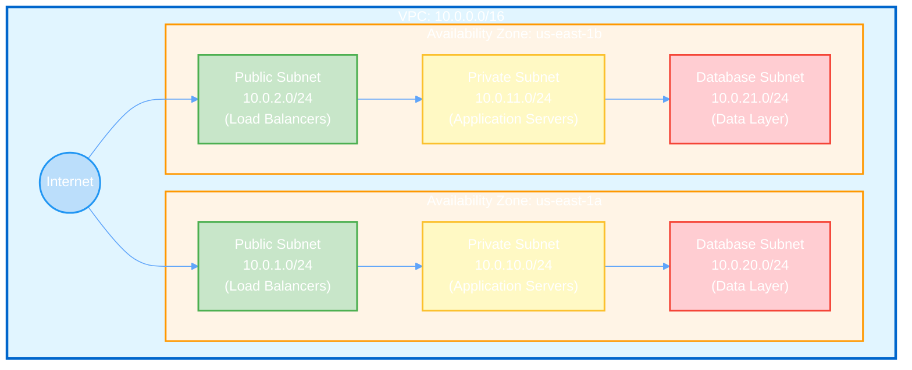

Crie sub-redes dentro de uma VPC para organizar e isolar seus recursos AWS.

## Pré-requisito: Configuração do AWSProvider

Antes de criar qualquer recurso AWS, você precisa configurar um **AWSProvider** que gerencia as credenciais e autenticação com a AWS.

<CodeGroup>
```yaml IRSA
apiVersion: infra.operator.aws.io/v1alpha1
kind: AWSProvider
metadata:
  name: production-aws
  namespace: default
spec:
  region: us-east-1
  roleARN: arn:aws:iam::123456789012:role/infra-operator-role
  defaultTags:
    managed-by: infra-operator
    environment: production
```

```yaml Credenciais Estáticas
apiVersion: v1
kind: Secret
metadata:
  name: aws-credentials
  namespace: default
type: Opaque
stringData:
  access-key-id: test
  secret-access-key: test
---
apiVersion: infra.operator.aws.io/v1alpha1
kind: AWSProvider
metadata:
  name: localstack
  namespace: default
spec:
  region: us-east-1
  accessKeyIDRef:
    name: aws-credentials
    key: access-key-id
  secretAccessKeyRef:
    name: aws-credentials
    key: secret-access-key
  defaultTags:
    managed-by: infra-operator
    environment: test
```

```bash Verificar Status
kubectl get awsprovider
kubectl describe awsprovider production-aws
```
</CodeGroup>

<Warning>
  Para produção, sempre use **IRSA** (IAM Roles for Service Accounts) ao invés de credenciais estáticas.
</Warning>

### Criar IAM Role para IRSA

Para usar IRSA em produção, você precisa criar uma IAM Role com as permissões necessárias:

<CodeGroup>
```json Trust Policy (trust-policy.json)
{
  "Version": "2012-10-17",
  "Statement": [
    {
      "Effect": "Allow",
      "Principal": {
        "Federated": "arn:aws:iam::123456789012:oidc-provider/oidc.eks.us-east-1.amazonaws.com/id/EXAMPLED539D4633E53DE1B71EXAMPLE"
      },
      "Action": "sts:AssumeRoleWithWebIdentity",
      "Condition": {
        "StringEquals": {
          "oidc.eks.us-east-1.amazonaws.com/id/EXAMPLED539D4633E53DE1B71EXAMPLE:sub": "system:serviceaccount:infra-operator-system:infra-operator-controller-manager",
          "oidc.eks.us-east-1.amazonaws.com/id/EXAMPLED539D4633E53DE1B71EXAMPLE:aud": "sts.amazonaws.com"
        }
      }
    }
  ]
}
```

```json IAM Policy - Subnet (subnet-policy.json)
{
  "Version": "2012-10-17",
  "Statement": [
    {
      "Effect": "Allow",
      "Action": [
        "ec2:CreateSubnet",
        "ec2:DeleteSubnet",
        "ec2:DescribeSubnets",
        "ec2:ModifySubnetAttribute",
        "ec2:CreateTags",
        "ec2:DeleteTags",
        "ec2:DescribeTags"
      ],
      "Resource": "*"
    }
  ]
}
```

```bash Criar Role com AWS CLI
# 1. Obter OIDC Provider do cluster EKS
export CLUSTER_NAME=my-cluster
export AWS_REGION=us-east-1
export AWS_ACCOUNT_ID=$(aws sts get-caller-identity --query Account --output text)

OIDC_PROVIDER=$(aws eks describe-cluster \
  --name $CLUSTER_NAME \
  --region $AWS_REGION \
  --query "cluster.identity.oidc.issuer" \
  --output text | sed -e "s/^https:\/\///")

# 2. Atualizar trust-policy.json com valores corretos
cat > trust-policy.json <<EOF
{
  "Version": "2012-10-17",
  "Statement": [
    {
      "Effect": "Allow",
      "Principal": {
        "Federated": "arn:aws:iam::${AWS_ACCOUNT_ID}:oidc-provider/${OIDC_PROVIDER}"
      },
      "Action": "sts:AssumeRoleWithWebIdentity",
      "Condition": {
        "StringEquals": {
          "${OIDC_PROVIDER}:sub": "system:serviceaccount:infra-operator-system:infra-operator-controller-manager",
          "${OIDC_PROVIDER}:aud": "sts.amazonaws.com"
        }
      }
    }
  ]
}
EOF

# 3. Criar IAM Role
aws iam create-role \
  --role-name infra-operator-subnet-role \
  --assume-role-policy-document file://trust-policy.json \
  --description "Role for Infra Operator Subnet management"

# 4. Criar e anexar policy
aws iam put-role-policy \
  --role-name infra-operator-subnet-role \
  --policy-name SubnetManagement \
  --policy-document file://subnet-policy.json

# 5. Obter ARN da Role
aws iam get-role \
  --role-name infra-operator-subnet-role \
  --query 'Role.Arn' \
  --output text
```

```bash Anotar ServiceAccount do Operator
# Adicionar annotation ao ServiceAccount do operator
kubectl annotate serviceaccount infra-operator-controller-manager \
  -n infra-operator-system \
  eks.amazonaws.com/role-arn=arn:aws:iam::123456789012:role/infra-operator-subnet-role
```
</CodeGroup>

<Note>
  Substitua `123456789012` pelo seu AWS Account ID e `EXAMPLED539D4633E53DE1B71EXAMPLE` pelo ID do seu OIDC provider.
</Note>

## Visão Geral

Uma Subnet (sub-rede) é uma divisão de uma VPC que permite segmentar sua rede em intervalos de endereços IP menores. Com Subnets, você pode:

- Organizar recursos em camadas (pública, privada, dados)
- Distribuir recursos entre Availability Zones para alta disponibilidade
- Implementar isolamento de segurança
- Controlar roteamento de tráfego de rede

## Início Rápido

<CodeGroup>
```yaml Subnet Pública
apiVersion: infra.operator.aws.io/v1alpha1
kind: Subnet
metadata:
  name: e2e-public-subnet
  namespace: default
spec:
  providerRef:
    name: localstack
  vpcID: REPLACE_WITH_VPC_ID
  cidrBlock: "10.0.1.0/24"
  availabilityZone: "us-east-1a"
  mapPublicIpOnLaunch: true
  tags:
    Name: e2e-public-subnet
    Type: public
    ManagedBy: infra-operator
  deletionPolicy: Delete
```

```yaml Subnet Privada
apiVersion: infra.operator.aws.io/v1alpha1
kind: Subnet
metadata:
  name: e2e-private-subnet
  namespace: default
spec:
  providerRef:
    name: localstack
  vpcID: REPLACE_WITH_VPC_ID
  cidrBlock: "10.0.2.0/24"
  availabilityZone: "us-east-1b"
  mapPublicIpOnLaunch: false
  tags:
    Name: e2e-private-subnet
    Type: private
    ManagedBy: infra-operator
  deletionPolicy: Delete
```

```bash Aplicar e Verificar
# Aplicar a subnet
kubectl apply -f subnet.yaml

# Verificar status
kubectl get subnets
kubectl describe subnet e2e-public-subnet
```
</CodeGroup>

## Referência de Configuração

### Campos Obrigatórios

<ParamField path="spec.providerRef" type="object" required>
  Referência ao recurso AWSProvider

  <Expandable title="properties">
    <ParamField path="name" type="string" required>
      Nome do recurso AWSProvider
    </ParamField>
  </Expandable>
</ParamField>

<ParamField path="spec.vpcID" type="string" required>
  ID da VPC onde a subnet será criada (exemplo: `vpc-xxx`)

  <Note>A VPC deve existir antes de criar a subnet</Note>
</ParamField>

<ParamField path="spec.cidrBlock" type="string" required>
  Bloco CIDR IPv4 para a subnet (exemplo: "10.0.1.0/24")

  **Requisitos:**
  - Deve estar dentro do CIDR da VPC
  - Não pode sobrepor outras subnets na VPC
  - Netmask permitida: /16 a /28
</ParamField>

### Campos Opcionais

<ParamField path="spec.availabilityZone" type="string">
  Availability Zone onde a subnet será criada (exemplo: `us-east-1a`)

  <Tip>Distribua subnets entre múltiplas AZs para alta disponibilidade</Tip>
</ParamField>

<ParamField path="spec.mapPublicIpOnLaunch" type="boolean" default="false">
  Se `true`, instâncias lançadas nesta subnet recebem IP público automaticamente

  **Use cases:**
  - `true`: Subnets públicas (web servers, load balancers)
  - `false`: Subnets privadas (databases, app servers)
</ParamField>

<ParamField path="spec.tags" type="object">
  Tags para organização e billing

  ```yaml
  tags:
    Name: public-subnet-1a
    Type: public
    kubernetes.io/role/elb: "1"  # Para EKS load balancers
  ```
</ParamField>

<ParamField path="spec.deletionPolicy" type="string" default="Delete">
  Política de deleção quando o CR é removido

  **Opções:**
  - `Delete`: Subnet é deletada da AWS
  - `Retain`: Subnet permanece na AWS
  - `Orphan`: Remove gerenciamento mas mantém na AWS
</ParamField>

## Campos de Status

<ResponseField name="status.subnetID" type="string">
  Identificador da subnet na AWS (exemplo: `subnet-12853af5337079de5`)
</ResponseField>

<ResponseField name="status.vpcID" type="string">
  ID da VPC pai
</ResponseField>

<ResponseField name="status.cidrBlock" type="string">
  Bloco CIDR atribuído à subnet
</ResponseField>

<ResponseField name="status.availabilityZone" type="string">
  AZ onde a subnet está localizada
</ResponseField>

<ResponseField name="status.state" type="string">
  Estado atual da subnet
  - `pending`: Sendo criada
  - `available`: Pronta para uso
</ResponseField>

<ResponseField name="status.availableIpAddressCount" type="integer">
  Número de endereços IP disponíveis na subnet
</ResponseField>

<ResponseField name="status.ready" type="boolean">
  `true` quando a subnet está disponível
</ResponseField>

## Exemplos

### Arquitetura Multi-AZ com Subnets Públicas e Privadas

```yaml
---
# Subnet Pública - AZ 1a
apiVersion: infra.operator.aws.io/v1alpha1
kind: Subnet
metadata:
  name: public-1a
spec:
  providerRef:
    name: production-aws
  vpcID: vpc-f3ea9b1b36fce09cd
  cidrBlock: "10.0.1.0/24"
  availabilityZone: us-east-1a
  mapPublicIpOnLaunch: true
  tags:
    Name: public-subnet-1a
    Type: public
    kubernetes.io/role/elb: "1"
  deletionPolicy: Delete

---
# Subnet Pública - AZ 1b
apiVersion: infra.operator.aws.io/v1alpha1
kind: Subnet
metadata:
  name: public-1b
spec:
  providerRef:
    name: production-aws
  vpcID: vpc-f3ea9b1b36fce09cd
  cidrBlock: "10.0.2.0/24"
  availabilityZone: us-east-1b
  mapPublicIpOnLaunch: true
  tags:
    Name: public-subnet-1b
    Type: public
    kubernetes.io/role/elb: "1"
  deletionPolicy: Delete

---
# Subnet Privada - AZ 1a
apiVersion: infra.operator.aws.io/v1alpha1
kind: Subnet
metadata:
  name: private-1a
spec:
  providerRef:
    name: production-aws
  vpcID: vpc-f3ea9b1b36fce09cd
  cidrBlock: "10.0.10.0/24"
  availabilityZone: us-east-1a
  mapPublicIpOnLaunch: false
  tags:
    Name: private-subnet-1a
    Type: private
    kubernetes.io/role/internal-elb: "1"
  deletionPolicy: Delete

---
# Subnet Privada - AZ 1b
apiVersion: infra.operator.aws.io/v1alpha1
kind: Subnet
metadata:
  name: private-1b
spec:
  providerRef:
    name: production-aws
  vpcID: vpc-f3ea9b1b36fce09cd
  cidrBlock: "10.0.11.0/24"
  availabilityZone: us-east-1b
  mapPublicIpOnLaunch: false
  tags:
    Name: private-subnet-1b
    Type: private
    kubernetes.io/role/internal-elb: "1"
  deletionPolicy: Delete
```

### Subnet para Banco de Dados (Isolada)

```yaml
apiVersion: infra.operator.aws.io/v1alpha1
kind: Subnet
metadata:
  name: database-subnet-1a
spec:
  providerRef:
    name: production-aws
  vpcID: vpc-f3ea9b1b36fce09cd
  cidrBlock: "10.0.20.0/24"
  availabilityZone: us-east-1a
  mapPublicIpOnLaunch: false
  tags:
    Name: database-subnet-1a
    Type: database
    Tier: data
    Encryption: required
  deletionPolicy: Retain  # Manter subnet de dados
```

## Verificação

### Verificar Status da Subnet

```bash
# Listar todas as subnets
kubectl get subnets

# Ver detalhes com IPs disponíveis
kubectl get subnet public-1a -o wide

# YAML completo
kubectl get subnet public-1a -o yaml
```

### Verificar na AWS

<Tabs>
  <Tab title="AWS CLI">
    ```bash
    # Listar subnets de uma VPC
    aws ec2 describe-subnets \
      --filters "Name=vpc-id,Values=vpc-xxx"

    # Detalhes de uma subnet específica
    aws ec2 describe-subnets \
      --subnet-ids subnet-xxx \
      --query 'Subnets[0]' \
      --output table
    ```
  </Tab>

  <Tab title="LocalStack">
    ```bash
    export AWS_ENDPOINT_URL=http://localhost:4566

    # Listar subnets
    aws ec2 describe-subnets \
      --filters "Name=vpc-id,Values=vpc-xxx" \
      --query 'Subnets[*].[SubnetId,CidrBlock,AvailabilityZone,State]' \
      --output table
    ```
  </Tab>
</Tabs>

## Troubleshooting

<AccordionGroup>
  <Accordion title="Erro: VPC ID não existe">
    **Erro:** `VpcID vpc-xxx does not exist`

    **Causas:**
    1. VPC ainda não foi criada
    2. VPC ID incorreto no spec
    3. VPC foi deletada

    **Soluções:**
    ```bash
    # Verificar se VPC existe
    kubectl get vpcs
    kubectl get vpc <vpc-name> -o jsonpath='{.status.vpcID}'

    # Atualizar subnet com VPC ID correto
    kubectl patch subnet <name> --type='json' \
      -p='[{"op": "replace", "path": "/spec/vpcID", "value":"vpc-xxx"}]'
    ```
  </Accordion>

  <Accordion title="Conflito de CIDR">
    **Erro:** `CIDR block 10.0.1.0/24 conflicts with existing subnet`

    **Causa:** Já existe subnet com CIDR sobreposto

    **Soluções:**
    1. Use CIDR diferente
    2. Verifique subnets existentes:
       ```bash
       aws ec2 describe-subnets \
         --filters "Name=vpc-id,Values=vpc-xxx" \
         --query 'Subnets[*].CidrBlock'
       ```
  </Accordion>

  <Accordion title="Subnet não fica ready">
    **Sintomas:** `ready: false` por mais de 2 minutos

    **Debug:**
    ```bash
    # Ver eventos
    kubectl describe subnet <name>

    # Logs do controller
    kubectl logs -n infra-operator-system \
      deploy/infra-operator-controller-manager \
      | grep subnet

    # Status detalhado
    kubectl get subnet <name> -o yaml
    ```
  </Accordion>

  <Accordion title="Sem IPs disponíveis">
    **Sintomas:** `availableIpAddressCount: 0`

    **Causas:**
    - Subnet muito pequena (/28 = apenas 11 IPs utilizáveis)
    - Muitas ENIs criadas

    **Soluções:**
    1. Criar subnet maior (/24 = 251 IPs)
    2. Limpar recursos não utilizados
    3. Deletar ENIs órfãs
  </Accordion>
</AccordionGroup>

## Melhores Práticas

<CardGroup cols={2}>
  <Card title="Planejamento de CIDR" icon="map">
    - /24 para subnets públicas (251 IPs)
    - /22 para subnets privadas (1019 IPs)
    - /20 para subnets EKS (4091 IPs)
    - Deixar espaço para crescimento
  </Card>

  <Card title="Multi-AZ" icon="layer-group">
    - Sempre crie subnets em 2+ AZs
    - Distribua workloads uniformemente
    - Use mesmos CIDRs em cada AZ
    - Exemplo: 10.0.1.0/24 (1a), 10.0.2.0/24 (1b)
  </Card>

  <Card title="Organização" icon="tags">
    - Tag `Type`: public/private/database
    - Tag `Tier`: web/app/data
    - Para EKS: kubernetes.io/role/elb
    - Nomes descritivos e consistentes
  </Card>

  <Card title="Segurança" icon="shield">
    - Pública: mapPublicIpOnLaunch=true
    - Privada: mapPublicIpOnLaunch=false
    - Banco de dados: sempre privada
    - Use Security Groups adicionais
  </Card>
</CardGroup>

## Padrões de Arquitetura

### Arquitetura de 3 Camadas

Arquitetura clássica de três camadas com subnets organizadas por função e distribuídas entre múltiplas Availability Zones para alta disponibilidade:



### EKS-Ready Subnets

```yaml
# Subnets para EKS precisam de tags específicas
tags:
  kubernetes.io/cluster/my-cluster: shared
  kubernetes.io/role/elb: "1"              # Pública
  kubernetes.io/role/internal-elb: "1"     # Privada
```

## Recursos Relacionados

<CardGroup cols={2}>
  <Card
    title="VPC"
    icon="network-wired"
    href="/services/networking/vpc"
  >
    Criar VPC antes das subnets
  </Card>

  <Card
    title="NAT Gateway"
    icon="arrow-right-arrow-left"
    href="/services/networking/nat-gateway"
  >
    Adicionar internet de saída para subnets privadas
  </Card>

  <Card
    title="Security Groups"
    icon="shield"
    href="/services/networking/security-group"
  >
    Configurar firewall para recursos
  </Card>

  <Card
    title="Guia Multi-Tier"
    icon="layer-group"
    href="/guides/multi-tier-network"
  >
    Arquitetura completa de rede
  </Card>
</CardGroup>
