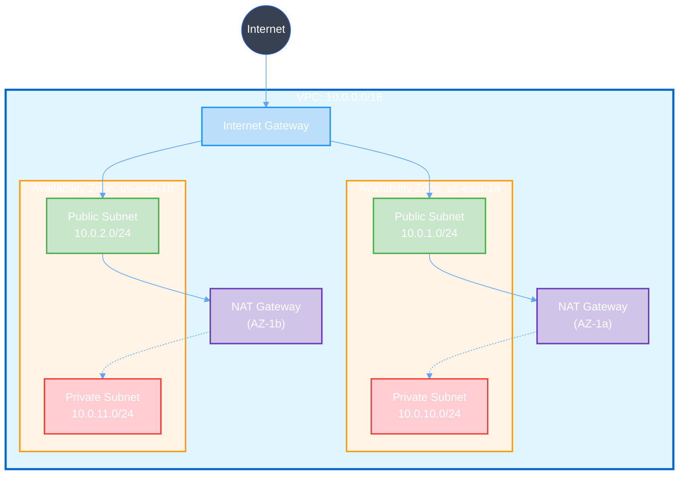
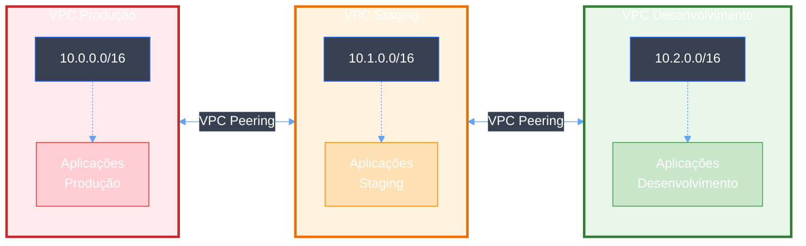

Crie redes virtuais isoladas na AWS para hospedar seus recursos com segurança.

## Pré-requisito: Configuração do AWSProvider

Antes de criar qualquer recurso AWS, você precisa configurar um **AWSProvider** que gerencia as credenciais e autenticação com a AWS.

<CodeGroup>
```yaml IRSA
apiVersion: infra.operator.aws.io/v1alpha1
kind: AWSProvider
metadata:
  name: production-aws
  namespace: default
spec:
  region: us-east-1
  roleARN: arn:aws:iam::123456789012:role/infra-operator-role
  defaultTags:
    managed-by: infra-operator
    environment: production
```

```yaml Credenciais Estáticas
apiVersion: v1
kind: Secret
metadata:
  name: aws-credentials
  namespace: default
type: Opaque
stringData:
  access-key-id: test
  secret-access-key: test
---
apiVersion: infra.operator.aws.io/v1alpha1
kind: AWSProvider
metadata:
  name: localstack
  namespace: default
spec:
  region: us-east-1
  accessKeyIDRef:
    name: aws-credentials
    key: access-key-id
  secretAccessKeyRef:
    name: aws-credentials
    key: secret-access-key
  defaultTags:
    managed-by: infra-operator
    environment: test
```

```bash Verificar Status
kubectl get awsprovider
kubectl describe awsprovider production-aws
```
</CodeGroup>

<Warning>
  Para produção, sempre use **IRSA** (IAM Roles for Service Accounts) ao invés de credenciais estáticas.
</Warning>

### Criar IAM Role para IRSA

Para usar IRSA em produção, você precisa criar uma IAM Role com as permissões necessárias:

<CodeGroup>
```json Trust Policy (trust-policy.json)
{
  "Version": "2012-10-17",
  "Statement": [
    {
      "Effect": "Allow",
      "Principal": {
        "Federated": "arn:aws:iam::123456789012:oidc-provider/oidc.eks.us-east-1.amazonaws.com/id/EXAMPLED539D4633E53DE1B71EXAMPLE"
      },
      "Action": "sts:AssumeRoleWithWebIdentity",
      "Condition": {
        "StringEquals": {
          "oidc.eks.us-east-1.amazonaws.com/id/EXAMPLED539D4633E53DE1B71EXAMPLE:sub": "system:serviceaccount:infra-operator-system:infra-operator-controller-manager",
          "oidc.eks.us-east-1.amazonaws.com/id/EXAMPLED539D4633E53DE1B71EXAMPLE:aud": "sts.amazonaws.com"
        }
      }
    }
  ]
}
```

```json IAM Policy - VPC (vpc-policy.json)
{
  "Version": "2012-10-17",
  "Statement": [
    {
      "Effect": "Allow",
      "Action": [
        "ec2:CreateVpc",
        "ec2:DeleteVpc",
        "ec2:DescribeVpcs",
        "ec2:ModifyVpcAttribute",
        "ec2:CreateTags",
        "ec2:DeleteTags",
        "ec2:DescribeTags"
      ],
      "Resource": "*"
    }
  ]
}
```

```bash Criar Role com AWS CLI
# 1. Obter OIDC Provider do cluster EKS
export CLUSTER_NAME=my-cluster
export AWS_REGION=us-east-1
export AWS_ACCOUNT_ID=$(aws sts get-caller-identity --query Account --output text)

OIDC_PROVIDER=$(aws eks describe-cluster \
  --name $CLUSTER_NAME \
  --region $AWS_REGION \
  --query "cluster.identity.oidc.issuer" \
  --output text | sed -e "s/^https:\/\///")

# 2. Atualizar trust-policy.json com valores corretos
cat > trust-policy.json <<EOF
{
  "Version": "2012-10-17",
  "Statement": [
    {
      "Effect": "Allow",
      "Principal": {
        "Federated": "arn:aws:iam::${AWS_ACCOUNT_ID}:oidc-provider/${OIDC_PROVIDER}"
      },
      "Action": "sts:AssumeRoleWithWebIdentity",
      "Condition": {
        "StringEquals": {
          "${OIDC_PROVIDER}:sub": "system:serviceaccount:infra-operator-system:infra-operator-controller-manager",
          "${OIDC_PROVIDER}:aud": "sts.amazonaws.com"
        }
      }
    }
  ]
}
EOF

# 3. Criar IAM Role
aws iam create-role \
  --role-name infra-operator-vpc-role \
  --assume-role-policy-document file://trust-policy.json \
  --description "Role for Infra Operator VPC management"

# 4. Criar e anexar policy
aws iam put-role-policy \
  --role-name infra-operator-vpc-role \
  --policy-name VPCManagement \
  --policy-document file://vpc-policy.json

# 5. Obter ARN da Role
aws iam get-role \
  --role-name infra-operator-vpc-role \
  --query 'Role.Arn' \
  --output text
```

```bash Anotar ServiceAccount do Operator
# Adicionar annotation ao ServiceAccount do operator
kubectl annotate serviceaccount infra-operator-controller-manager \
  -n infra-operator-system \
  eks.amazonaws.com/role-arn=arn:aws:iam::123456789012:role/infra-operator-vpc-role
```
</CodeGroup>

<Note>
  Substitua `123456789012` pelo seu AWS Account ID e `EXAMPLED539D4633E53DE1B71EXAMPLE` pelo ID do seu OIDC provider.
</Note>

## Visão Geral

Uma Virtual Private Cloud (VPC) é uma seção logicamente isolada da nuvem AWS onde você pode lançar recursos AWS em uma rede virtual que você define. Com VPC, você tem controle completo sobre seu ambiente de rede virtual, incluindo:

- Seleção de faixa de endereços IP
- Criação de sub-redes
- Configuração de tabelas de roteamento
- Configuração de gateways de rede

## Início Rápido

<CodeGroup>
```yaml VPC Básico
apiVersion: infra.operator.aws.io/v1alpha1
kind: VPC
metadata:
  name: e2e-test-vpc
  namespace: default
spec:
  providerRef:
    name: localstack
  cidrBlock: "10.0.0.0/16"
  enableDnsSupport: true
  enableDnsHostnames: true
  tags:
    Name: e2e-test-vpc
    Environment: testing
    ManagedBy: infra-operator
  deletionPolicy: Delete
```

```yaml VPC de Produção
apiVersion: infra.operator.aws.io/v1alpha1
kind: VPC
metadata:
  name: production-vpc
  namespace: default
spec:
  providerRef:
    name: production-aws
  cidrBlock: "10.0.0.0/16"
  enableDnsSupport: true
  enableDnsHostnames: true
  tags:
    Name: production-vpc
    Environment: production
    Team: platform
    CostCenter: engineering
  deletionPolicy: Retain
```

```bash Aplicar
kubectl apply -f vpc.yaml
```

```bash Verificar Status
kubectl get vpc
kubectl describe vpc e2e-test-vpc
```
</CodeGroup>

## Referência de Configuração

### Campos Obrigatórios

<ParamField path="spec.providerRef" type="object" required>
  Referência ao recurso AWSProvider

  <Expandable title="properties">
    <ParamField path="name" type="string" required>
      Nome do recurso AWSProvider
    </ParamField>
  </Expandable>
</ParamField>

<ParamField path="spec.cidrBlock" type="string" required>
  Bloco CIDR IPv4 para a VPC (ex: "10.0.0.0/16")

  **Faixas válidas:**
  - 10.0.0.0 - 10.255.255.255 (prefixo 10/8)
  - 172.16.0.0 - 172.31.255.255 (prefixo 172.16/12)
  - 192.168.0.0 - 192.168.255.255 (prefixo 192.168/16)

  **Máscara de rede permitida:** /16 a /28
</ParamField>

### Campos Opcionais

<ParamField path="spec.enableDnsSupport" type="boolean" default="true">
  Habilita resolução DNS na VPC. Quando habilitado, instâncias na VPC podem resolver hostnames DNS.
</ParamField>

<ParamField path="spec.enableDnsHostnames" type="boolean" default="false">
  Habilita hostnames DNS na VPC. Instâncias recebem hostnames DNS públicos que correspondem aos seus endereços IP públicos.

  <Note>Requer `enableDnsSupport: true`</Note>
</ParamField>

<ParamField path="spec.instanceTenancy" type="string" default="default">
  Opção de tenancy para instâncias lançadas na VPC

  **Opções:**
  - `default`: Instâncias executam em hardware compartilhado
  - `dedicated`: Instâncias executam em hardware de inquilino único (custo adicional)
</ParamField>

<ParamField path="spec.tags" type="object">
  Pares chave-valor para marcar a VPC

  ```yaml
  tags:
    Name: production-vpc
    Environment: production
    Team: platform
  ```
</ParamField>

<ParamField path="spec.deletionPolicy" type="string" default="Delete">
  O que acontece com a VPC quando o CR é deletado

  **Opções:**
  - `Delete`: VPC é deletada da AWS
  - `Retain`: VPC permanece na AWS mas não gerenciada
  - `Orphan`: VPC permanece mas ownership do CR é removida
</ParamField>

## Campos de Status

Após a VPC ser criada, os seguintes campos de status são populados:

<ResponseField name="status.vpcID" type="string">
  Identificador AWS da VPC (ex: `vpc-f3ea9b1b36fce09cd`)
</ResponseField>

<ResponseField name="status.cidrBlock" type="string">
  Bloco CIDR atribuído à VPC
</ResponseField>

<ResponseField name="status.state" type="string">
  Estado atual da VPC
  - `pending`: VPC está sendo criada
  - `available`: VPC está pronta para uso
</ResponseField>

<ResponseField name="status.ready" type="boolean">
  `true` quando a VPC está disponível e pronta para uso
</ResponseField>

<ResponseField name="status.lastSyncTime" type="string">
  Timestamp da última sincronização com a AWS
</ResponseField>

## Examples

### VPC de Produção

VPC de alta disponibilidade para cargas de trabalho de produção:

```yaml
apiVersion: infra.operator.aws.io/v1alpha1
kind: VPC
metadata:
  name: production-vpc
  namespace: default
spec:
  providerRef:
    name: production-aws

  # CIDR grande para muitas subnets
  cidrBlock: "10.0.0.0/16"

  # Habilitar DNS para service discovery
  enableDnsSupport: true
  enableDnsHostnames: true

  # Hardware compartilhado (custo-benefício)
  instanceTenancy: default

  tags:
    Name: production-vpc
    Environment: production
    ManagedBy: infra-operator
    CostCenter: engineering

  # Manter VPC se o CR for deletado
  deletionPolicy: Retain
```

### VPC de Desenvolvimento

VPC menor para ambiente de desenvolvimento:

```yaml
apiVersion: infra.operator.aws.io/v1alpha1
kind: VPC
metadata:
  name: dev-vpc
  namespace: default
spec:
  providerRef:
    name: localstack

  # CIDR menor para dev
  cidrBlock: "172.16.0.0/16"

  enableDnsSupport: true
  enableDnsHostnames: true

  tags:
    Name: development-vpc
    Environment: development
    AutoShutdown: "true"

  # Deletar VPC ao fazer cleanup
  deletionPolicy: Delete
```

### VPCs Multi-Ambiente

VPCs separadas para cada ambiente:

<CodeGroup>
```yaml Production
apiVersion: infra.operator.aws.io/v1alpha1
kind: VPC
metadata:
  name: prod-vpc
spec:
  providerRef:
    name: production-aws
  cidrBlock: "10.0.0.0/16"
  enableDnsSupport: true
  enableDnsHostnames: true
  tags:
    Name: production-vpc
    Environment: production
  deletionPolicy: Retain
```

```yaml Staging
apiVersion: infra.operator.aws.io/v1alpha1
kind: VPC
metadata:
  name: staging-vpc
spec:
  providerRef:
    name: production-aws
  cidrBlock: "10.1.0.0/16"
  enableDnsSupport: true
  enableDnsHostnames: true
  tags:
    Name: staging-vpc
    Environment: staging
  deletionPolicy: Delete
```

```yaml Development
apiVersion: infra.operator.aws.io/v1alpha1
kind: VPC
metadata:
  name: dev-vpc
spec:
  providerRef:
    name: production-aws
  cidrBlock: "10.2.0.0/16"
  enableDnsSupport: true
  enableDnsHostnames: true
  tags:
    Name: development-vpc
    Environment: development
  deletionPolicy: Delete
```
</CodeGroup>

## Verificação

### Verificar Status da VPC

```bash
# Listar todas as VPCs
kubectl get vpcs

# Obter informações detalhadas da VPC
kubectl get vpc production-vpc -o yaml

# Acompanhar criação da VPC
kubectl get vpc production-vpc -w
```

### Verificar na AWS

<Tabs>
  <Tab title="AWS CLI">
    ```bash
    # Listar VPCs
    aws ec2 describe-vpcs --vpc-ids vpc-xxx

    # Obter detalhes da VPC
    aws ec2 describe-vpcs \
      --vpc-ids vpc-xxx \
      --query 'Vpcs[0]' \
      --output json
    ```
  </Tab>

  <Tab title="LocalStack">
    ```bash
    # Para testes com LocalStack
    export AWS_ENDPOINT_URL=http://localhost:4566

    aws ec2 describe-vpcs \
      --vpc-ids vpc-xxx
    ```
  </Tab>
</Tabs>

### Saída Esperada

```yaml
status:
  vpcID: vpc-f3ea9b1b36fce09cd
  cidrBlock: 10.0.0.0/16
  state: available
  ready: true
  lastSyncTime: "2025-11-22T20:18:08Z"
```

## Resolução de Problemas

<AccordionGroup>
  <Accordion title="VPC travada em estado pending">
    **Sintomas:** VPC `state` está `pending` por mais de 2 minutos

    **Causas comuns:**
    1. Credenciais do AWSProvider inválidas
    2. Problemas de conectividade de rede
    3. Limitação de taxa da API AWS

    **Soluções:**
    ```bash
    # Verificar status do AWSProvider
    kubectl describe awsprovider production-aws

    # Verificar logs do controller
    kubectl logs -n infra-operator-system \
      deploy/infra-operator-controller-manager \
      --tail=100

    # Verificar eventos da VPC
    kubectl describe vpc production-vpc
    ```
  </Accordion>

  <Accordion title="Bloco CIDR já existe">
    **Erro:** `"CIDR block 10.0.0.0/16 conflicts with existing VPC"`

    **Causa:** Outra VPC com o mesmo CIDR existe na conta

    **Soluções:**
    - Use um bloco CIDR diferente
    - Delete a VPC conflitante
    - Use VPC peering se conectividade for necessária
  </Accordion>

  <Accordion title="Deleção travada">
    **Sintomas:** Deleção da VPC demora muito ou trava

    **Causa:** Recursos ainda anexados à VPC (subnets, IGW, etc.)

    **Soluções:**
    ```bash
    # Verificar recursos anexados
    aws ec2 describe-subnets --filters "Name=vpc-id,Values=vpc-xxx"
    aws ec2 describe-internet-gateways --filters "Name=attachment.vpc-id,Values=vpc-xxx"

    # Deletar recursos dependentes primeiro
    kubectl delete subnet <subnet-name>
    kubectl delete internetgateway <igw-name>

    # Depois deletar a VPC
    kubectl delete vpc production-vpc
    ```
  </Accordion>

  <Accordion title="DNS não está funcionando">
    **Sintomas:** Instâncias não conseguem resolver hostnames DNS

    **Soluções:**
    1. Garanta que `enableDnsSupport: true`
    2. Garanta que `enableDnsHostnames: true` para DNS público
    3. Verifique as opções DHCP da VPC

    ```yaml
    spec:
      enableDnsSupport: true
      enableDnsHostnames: true
    ```
  </Accordion>
</AccordionGroup>

## Melhores Práticas

<CardGroup cols={2}>
  <Card title="Planejamento CIDR" icon="map">
    - Use /16 para produção (65.536 IPs)
    - Reserve espaço para crescimento futuro
    - Não sobreponha com redes on-premises
    - Documente alocação de CIDR
  </Card>

  <Card title="Estratégia de Tags" icon="tags">
    - Sempre marque com `Environment`
    - Inclua `ManagedBy: infra-operator`
    - Adicione tags de alocação de custos
    - Use nomenclatura consistente
  </Card>

  <Card title="Política de Deleção" icon="shield-halved">
    - Use `Retain` para VPCs de produção
    - Use `Delete` para dev/test
    - Documente políticas de retenção
    - Backup/documentação regular
  </Card>

  <Card title="Configurações DNS" icon="globe">
    - Habilite suporte DNS para service discovery
    - Habilite hostnames DNS para serviços públicos
    - Use Route53 para DNS customizado
    - Documente arquitetura DNS
  </Card>
</CardGroup>

## Padrões de Arquitetura

### Arquitetura VPC Única

Configuração típica com subnets públicas e privadas distribuídas em múltiplas zonas de disponibilidade para alta disponibilidade:



### Arquitetura Multi-VPC

Arquitetura de múltiplas VPCs isoladas por ambiente, conectadas via VPC Peering para comunicação segura:



## Recursos Relacionados

<CardGroup cols={2}>
  <Card
    title="Subnet"
    icon="sitemap"
    href="/services/networking/subnet"
  >
    Crie subnets dentro da sua VPC para segmentação de rede
  </Card>

  <Card
    title="Internet Gateway"
    icon="globe"
    href="/services/networking/internet-gateway"
  >
    Adicione conectividade com internet à sua VPC
  </Card>

  <Card
    title="NAT Gateway"
    icon="arrow-right-arrow-left"
    href="/services/networking/nat-gateway"
  >
    Habilite internet de saída para subnets privadas
  </Card>

  <Card
    title="Guia de Rede Multi-Tier"
    icon="layer-group"
    href="/guides/multi-tier-network"
  >
    Guia completo para arquitetura de rede de produção
  </Card>
</CardGroup>
